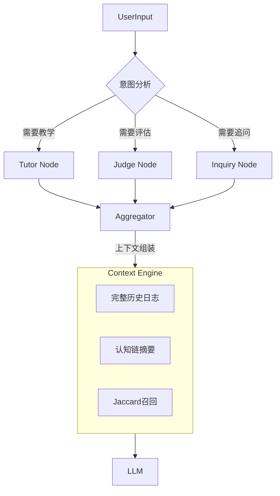

# ChatTutor 

> **“一场对话，就是一次学习。”**

ChatTutor 是一个基于 **LangGraph** 构建的学习型 Agent 实验项目。它的核心目的是探索长上下文（Long Context）下的记忆管理与教学交互。

通过集成**主动引导**和**结构化互动**（如苏格拉底式提问），ChatTutor 尝试协助用户对特定主题进行深入探讨，而非仅停留在表面的单轮问答。它利用一套**混合记忆架构**来对抗“灾难性遗忘”，力求在数十轮对话后，依然能准确回溯早期的上下文细节，从而支持一个相对完整的学习过程。

## 🎯 产品理念

### 1. 交互范式：对话即学习 (Paradigm: Conversation as Learning)

回溯我个人的学习路径，很多时候是在与大模型的反复对话中完成的。我意识到，**对话的过程本身就是思维构建的过程**。这也正契合了“苏格拉底学习法”的精髓——不仅是获取知识，更是通过不断的被提问、被迫解答，来倒逼自己挖掘底层逻辑。

出于这个初衷，我构建这个项目的核心目标，是探索一种超越简单问答（Q&A）的交互形式。我希望它不仅仅是一个只会“给答案”的工具，更是一个能主动反问、引导你深入思考的学习 Tutor。

### 2. 教学身份设定

为了实现动态教学，我们的 Tutor 定义了三种核心行为模式，根据用户的输入意图进行状态流转：
- **🎓 导师模式 (Tutor)**: **结构化输出**。针对知识盲区，提供自顶向下的概念框架与知识点拆解。
- **⚖️ 裁判模式 (Judge)**: **逻辑校验**。当用户尝试解释概念时，调用校验逻辑识别潜在的逻辑漏洞或认知偏差。
- **❓ 探究模式 (Inquiry)**: **启发式追问**。采用苏格拉底式发问（Socratic Method），在用户满足于表面答案时进行深度挖掘，逼迫其思考底层逻辑。

## 🌟 技术核心

为了支撑长达数小时的深度对话，ChatTutor 解决了大模型在长窗口下的“灾难性遗忘”问题，实现了**真正的长期认知连续性**。

| 记忆类型 (Memory Type) | 机制 (Mechanism) | 作用 (Function) | 更新频率 |
| :--- | :--- | :--- | :--- |
| **短期工作记忆**<br>(Working Memory) | **滑动窗口**<br>(Sliding Window) | 保留最近 **12条** 原始对话，确保即时交互流畅，解决指代消解（如“那个是什么”）。 | 实时 (Real-time) |
| **长期认知链**<br>(Cognitive Chain) | **摘要压缩**<br>(Semantic Compression) | 每隔 **16条** 消息，调用 LLM 将旧对话蒸馏为高密度的“认知状态摘要”，记录用户从不懂到懂的学习路径。 | 低频 (Batch) |
| **关联联想记忆**<br>(Associative Recall) | **Jaccard 召回**<br>(Jaccard Similarity) | 当用户提问时，实时扫描**所有历史记录**（即便是100轮之前的），基于字符级相似度精准召回相关细节（如某个参数的具体值）。 | 按需 (On-Demand) |

### 智能意图路由 
Agent 不是线性的问答机器，而是基于 **Analyzer** 节点进行动态规划：
- **Tutor Mode**: 传授知识。
- **Judge Mode**: 评估用户的观点是否正确。
- **Inquiry Mode**: 主动追问，引导用户深度思考。
- **Reference**: 集成 **百度搜索 API**，支持联网 RAG。

## 🏗️ 系统架构 



## 🛠️ 安装与配置 

### 1. 克隆仓库
```bash
git clone https://github.com/yourusername/chat-tutor.git
cd chat-tutor
```

### 2. 环境准备
推荐使用 Python 3.10+。
```bash
python -m venv venv
source venv/bin/activate  # Windows: venv\Scripts\activate
pip install -r requirements.txt
```

### 3. 配置密钥 (.env)
复制 `.env.example` (如果存在) 或创建 `.env` 文件，填入以下必要信息：
```ini
# Core LLM Provider
DEEPSEEK_API_KEY=sk-xxxxxxxxxxxxxxxx

# Search Tool (Optional)
BAIDU_API_KEY=xxxxxxxxxxxx
```

## 🚀 运行指南 (Usage)

### 启动交互式终端 (CLI)
这是最直接的使用方式，进入沉浸式学习模式：
```bash
python app/cli.py
```

### 运行记忆机制仿真测试
想亲眼看看它是如何“记住”第1轮的话，并在第20轮“召回”它的吗？运行这个脚本：
```bash
python tests/test_simulation.py
```
> 该脚本会模拟一个用户从零学习“随机森林”算法的完整过程（20轮连续对话），并实时打印内存状态、压缩游标和召回命中情况。

## 📂 项目结构

```text
ChatTutor/
├── app/
│   ├── cli.py              # 命令行入口
│   ├── core/
│   │   ├── agent_builder.py # LangGraph 图构建与节点逻辑
│   │   ├── context.py       # [核心] 上下文拼装、摘要、召回逻辑
│   │   ├── memory.py        # 磁盘 I/O 与持久化
│   │   ├── models.py        # Pydantic 数据模型定义
│   │   ├── prompts.py       # Prompt 模板管理
│   │   └── tools.py         # 外部工具 (Search)
│   └── utils/
├── memory/                 # 运行时数据存储 (Git Ignored)
│   ├── sessions/           # 对话 Session JSON
│   └── notes/              # 生成的 Markdown 学习笔记
├── tests/                  # 测试套件
└── requirements.txt
```

## 🚧 项目状态与路线图 (Status & Roadmap)

本项目目前处于 **Workshop / MVP (Minimum Viable Product)** 阶段，核心逻辑已验证闭环，但工程化方面仍有广阔的迭代空间。以下是我们针对 Production-Ready 目标的演进规划：

| 模块 (Module) | 当前实现 (Current Workshop) | 未来规划 (Future Roadmap) | 目的 (Goal) |
| :--- | :--- | :--- | :--- |
| **持久化存储**<br>(Storage) | **JSON Files**<br>(本地文件系统) | **PostgreSQL + SQLAlchemy**<br>(关系型数据库) | 支持高并发读写、事务安全性及多用户数据隔离。 |
| **检索增强**<br>(Retrieval) | **Jaccard Similarity**<br>(内存级字符匹配) | **Vector DB (Chroma/Milvus)**<br>+ Hybrid Search (Keyword + Embedding) | 提升语义理解能力，支持海量非结构化文档的检索。 |
| **服务架构**<br>(Architecture) | **Sync CLI**<br>(同步阻塞命令行) | **FastAPI + Celery/Redis**<br>(异步微服务) | 解耦计算与 I/O，支持后台任务队列（如离线长文档摘要）。 |
| **交互接口**<br>(Interface) | **Python Rich Console**<br>(纯文本终端) | **Next.js / Streamlit**<br>(WebSocket 流式前端) | 提供可视化知识图谱展示、Markdown 实时渲染及更好的交互体验。 |

我们非常欢迎社区开发者参与到这些工程化挑战中来！

## 👨‍💻 关于本项目 (About)
本项目是一个 **Concept Demo**，初衷有二：
1. **Agent 技术探索**：作为学习 LangGraph 与 LLM 记忆管理的实践场，探索“长对话语境下的人格维持与知识检索”等课题。
2. **个人工具**：打造一个能真正陪伴自己深度学习、不会聊着聊着就失忆的私人 AI 导师。

目前主要用于技术验证与个人自用，暂无严格的长期维护计划。如果你对该项目感兴趣，欢迎 Fork 魔改或通过 Issue 交流想法！

## 📄 License
MIT License
