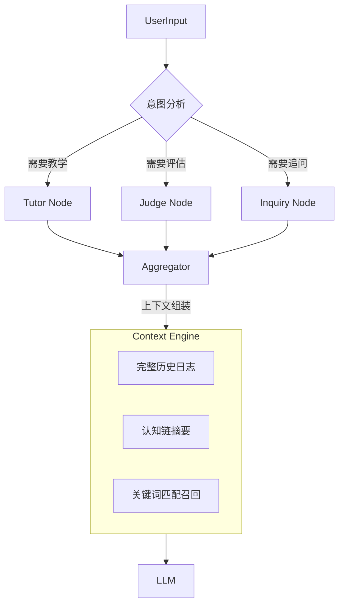

# ChatTutor：一场对话，即是一次学习

> **“一场对话，就是一次学习。”**

## 产品简介

ChatTutor 是一款定位于个人学习上的陪伴型导师 Agent。产品的核心理念为“一场对话，即是一次学习。”我们把每场和 ChatTutor 的对话都看作是一次学习过程，在这过程中 ChatTutor 既能作为专业的 Tutor 来对你的问题进行回答，也能作为和你共同学习的同行，提出深入、有见解的问题一起思考，引导你更深刻、全面地进行学习。


## 灵感来源

为何要做 ChatTutor？其实更多的需求都是通过身边的经历所发现的。

### 1. 入门大模型的经历

在我本人入门大模型的过程中，实际上也是脱离不开大模型的。当我们在看开源学习资料、相关论文、博客的过程中，如果出现了不懂的概念，都会通过去和大模型进行交流，来让大模型来回答自己的问题。同时自己在学习的过程中，更喜欢将自己对于一些知识的理解，用自己的话总结并复述给大模型，让大模型来判断我的理解是否正确，从而正确地进行学习。

基于我学习的方式，因此产生了做一个专注于个人教育过程的 Agent 的想法。虽说现在通用大模型都可以具备对应能力，但是反复通过复制 Prompt 模版来引导通用大模型按照我们预想的方式进行交流是一件反复而无义的事情。既然自己本身有设计、实现 Agent 的能力，不如就自己设计一个对应的产品，先服务于自己。做产品，首先自身有痛点，产品能解决自身的痛点。同时作为自用的产品，自己也是第一个客户，能够从“设计者”到“使用者”更好地提升产品。

### 2. 苏格拉底学习法

对于学习法，以前只听说过费曼学习法，即将自己学到的知识复述并教会他人来进行学习。在和同学交流时，同学转发了晓辉博士的视频，视频里介绍了苏格拉底学习法。苏格拉底学习法，也被称为“精神助产术”或“问答法”，即一种通过对话和提问来引导思考、揭示认知矛盾，最终让学习者自己发现真理的教学方法。

我非常赞同这一种学习方法，回顾自己的学习过程，在大模型的加持下，这相当于就转换了一种教学-学习身份。以前都是我来提问或阐述观点，让大模型来解答和判断。这时加入苏格拉底学习法，运用大模型的语义理解能力和推理能力，可以在交流中更好地抓住我们的回答里的一些漏洞，亦或者发掘出我们仍并未了解的角度，接着在通过对话、提问的方式，帮助我们找到知识的漏洞并更全面地进行学习。

### 3. 相同定位的产品体验

在这一类教育类的产品中，我觉得做得最好的就是谷歌公司的 NoteBookLM。我觉得这就是未来工具的交互形式，更多地以“对话”为重点，并附加以各种工具，例如总结成卡片、思维导图等辅助我们学习。此外，NoteBookLM 还有强大的 Deep Research 能力，通过上网检索相关文献，亦或者自行上传文献，再凭借着强大的 RAG 检索能力，能够更好的结合起来解决学习问题。因此这是一个很好的产品。

但是传统的大模型产品也有缺点：传统大模型像一个搜索引擎，只负责单向输出信息。但是往往看懂答案不等于掌握了知识，所以为了让 AI 扮演好的导师角色，用户需要反复调试复杂的 Prompt。而且学习者很难判断自己是否真的理解了，缺乏一个能够通过追问来检验其认知漏洞的老师。

基于以上灵感，我们希望打造一款 AI 教育产品——ChatTutor，致力于实现以下目标：

1. NoteBookLM 在国内访问存在门槛，使用不便。我们希望推出一款本土化的 AI+教育产品，让更广泛的用户能够轻松体验此类智能学习工具。
2. NoteBookLM 主要围绕上传材料进行问答（如解读论文），而我们的重点不止于检索信息作答，更在于打造一个富有“对话感”的学习陪伴者，让交互更具温度与引导性。
3. 融入两种经典学习方法，丰富学习体验：通过费曼学习法，鼓励用户用自己的语言复述概念，由 ChatTutor 的 Judge 节点评估其理解准确性，模拟“教学相长”的过程；通过苏格拉底问答法，以连续、有深度的追问引导用户反思，帮助其在对话中自主发现认知盲区，实现对知识的深层建构。

## 特色亮点

### 1. 隐型状态显示

我们在学习过程中，更多期盼的是一个“亦师亦友”的角色，希望以一种平等的方式进行交流，并从交流中学习到内容。因此在设计产品的时候，并未显式将 ChatTutor 的当前状态：即处于专业 Tutor 状态进行解答、处于苏格拉底导师式进行提问等显示出来，而是将相关状态的回答进行聚合后融入到 ChatTutor 的回答之中。

### 2. 不止会回答，更会提问

在以往使用 LLM 时其作为的角色更多地只进行知识传授、解答疑惑的状态。ChatTutor 除了擅长对应这个场景以外，还会根据当前对话的内容和学习者对知识的理解，在对话最后提出对应的问题让学习者解答，辅助学习者能够更好地对当前学习的主题有更深刻的了解和学习。

### 3. 对话感交流，避免长篇大论

在产品设计的过程中，也有使用并借鉴了一些对话类大模型产品的特点，例如谷歌的 NoteBookLM、小红书的点点。在使用这一类产品的过程中，我们发现其在交互的过程中的回复都是简短且直击重点的，并未产生太长的 markdown 文档形式的小博客式的回答，这很符合一种“对话”的感觉。因此在 ChatTutor 中会更追求这种“对话感”的实现，尽可能避免长篇大论介绍问题，使得能够更以一种对话的交流下让学习者能够更好地沉浸在交流学习的氛围中。

### 4. 差异化定位

目前市面上的主流教育类 AI（如 Google NoteBookLM）多采用 "Document-Centric"（文档中心） 模式，侧重于利用 RAG 技术帮助用户快速总结文献。

ChatTutor 则定义了全新的 "Learner-Centric"（学习者中心）范式：

*   **主动性差异**：传统工具被动等待提问，ChatTutor 通过 Inquiry 节点主动发起苏格拉底式追问。
*   **目标差异**：竞品旨在“节省阅读时间”，ChatTutor 旨在“增加思考深度”。
*   **场景差异**：我们不只是阅读助手，而是通过逻辑校验（Judge）与启发式引导，填补了“从看懂到学会”之间的认知鸿沟。

## 技术核心

### 1. 以 LangGraph 框架构建的多模型协作架构

为了实现我们的产品，我们使用了 LangGraph 来构建我们的 Agent。对于场景中，ChatTutor 定义了三种核心行为模式，根据用户的输入意图进行状态流转：

- **导师模式（Tutor）**：结构化输出。针对知识盲区或学习者提出的问题，提供自顶向下的概念框架与知识点拆解，并辅以正确的回答。
- **裁判模型（Judge）**：逻辑校验。当用户尝试解释概念或提出自己的观点时，调用校验逻辑识别潜在的逻辑漏洞或认知偏差。
- **探究模式（Inquiry）**：启发式追问。采用苏格拉底式发问（Socratic Method），在用户满足于表面答案时同时进行深度挖掘，逼迫其思考底层逻辑。



### 2. 工具赋能高效学习

除了三种核心行为模式外，ChatTutor 也提供了一些工具以赋能学习。

- **对话总结记录**：当学习过程中忘记当场对话前面学习了什么，可以跟模型说“总结一下刚刚讨论过什么”等带有总结意向的指令，当Agent 的 Analyzer 节点分析出意图后，便会自动调用总结模块对先前的内容进行总结并展现。
- **学习记录报告生成**：当学习结束后，可以对模型发出“谢谢你，我要结束学习了”等带有结束意图的指令，当 Agent 的 Analyzer 节点分析出对应意图后，便会自动调用学习报告生成模块对整个对话整理成学习报告并自动保存，最后并自动结束对话。
- **联网搜索**：集成了百度搜索 API，支持联网搜索带有实时性、准确的信息支持对话，并以此能够更有效进行学习。

### 3. 上下文保持长期认知连续性

为了支撑长达数小时的深度对话，ChatTutor 解决了大模型在长窗口下的“灾难性遗忘”问题，实现了真正的长期认知连续性。详细来讲，在与大模型交互的过程中，提供给大模型的信息设置为：
$$
上下文记忆=滑动窗口短期工作记忆+摘要压缩长期认知链+关联联想记忆
$$

| 记忆类型 (Memory Type)                   | 机制 (Mechanism)                         | 作用 (Function)                                              | 更新频率         |
| :--------------------------------------- | :--------------------------------------- | :----------------------------------------------------------- | :--------------- |
| **短期工作记忆**<br>(Working Memory)     | **滑动窗口**<br>(Sliding Window)         | 保留最近 **12条** 原始对话，确保即时交互流畅，解决指代消解（如“那个是什么”）。 | 实时 (Real-time) |
| **长期认知链**<br>(Cognitive Chain)      | **摘要压缩**<br>(Semantic Compression)   | 每隔 **16条** 消息，调用 LLM 将旧对话蒸馏为高密度的“认知状态摘要”，记录用户从不懂到懂的学习路径。 | 低频 (Batch)     |
| **关联联想记忆**<br>(Associative Recall) | **关键词匹配召回**<br>(Keyword-based Recall) | 当用户提问时，实时扫描**所有历史记录**（即便是100轮之前的），基于精准召回相关细节（如某个参数的具体值）。 | 按需 (On-Demand) |

## 🛠️ 安装与配置

### 1. 克隆仓库
```bash
git clone https://github.com/DjTaNg-404/ChatTutor.git
cd ChatTutor
```

### 2. 环境准备
推荐使用 Python 3.10+。
```bash
python -m venv venv
source venv/bin/activate  # Windows: venv\Scripts\activate
pip install -r requirements.txt
```

### 3. 配置密钥 (.env)
复制 `.env.example` (如果存在) 或创建 `.env` 文件，填入以下必要信息：
```ini
# Core LLM Provider
DEEPSEEK_API_KEY=sk-xxxxxxxxxxxxxxxx

# Search Tool (Optional)
BAIDU_API_KEY=xxxxxxxxxxxx
```

## 🚀 运行指南 (Usage)

### 启动交互式终端 (CLI)
这是最直接的使用方式，进入沉浸式学习模式：
```bash
python app/cli.py
```

### 运行记忆机制仿真测试
想亲眼看看它是如何“记住”第1轮的话，并在第20轮“召回”它的吗？运行这个脚本：
```bash
python tests/test_simulation.py
```
> 该脚本会模拟一个用户从零学习“随机森林”算法的完整过程（20轮连续对话），并实时打印内存状态、压缩游标和召回命中情况。

## 📂 项目结构

```text
ChatTutor/
├── app/
│   ├── cli.py              # 命令行入口
│   ├── core/
│   │   ├── agent_builder.py # LangGraph 图构建与节点逻辑
│   │   ├── context.py       # [核心] 上下文拼装、摘要、召回逻辑
│   │   ├── memory.py        # 磁盘 I/O 与持久化
│   │   ├── models.py        # Pydantic 数据模型定义
│   │   ├── prompts.py       # Prompt 模板管理
│   │   └── tools.py         # 外部工具 (Search)
│   └── utils/
├── memory/                 # 运行时数据存储 (Git Ignored)
│   ├── sessions/           # 对话 Session JSON
│   └── notes/              # 生成的 Markdown 学习笔记
├── tests/                  # 测试套件
└── requirements.txt
```

## 未来计划与畅想

本项目目前处于 **Workshop / MVP (Minimum Viable Product)** 阶段，核心逻辑已验证闭环，但工程化方面仍有广阔的迭代空间。以下是我们针对 Production-Ready 目标的演进规划：

| 模块 (Module)                  | 当前实现 (Current Workshop)                | 未来规划 (Future Roadmap)                                    | 目的 (Goal)                                                 |
| :----------------------------- | :----------------------------------------- | :----------------------------------------------------------- | :---------------------------------------------------------- |
| **持久化存储**<br>(Storage)    | **JSON Files**<br>(本地文件系统)           | **PostgreSQL + SQLAlchemy**<br>(关系型数据库)                | 支持高并发读写、事务安全性及多用户数据隔离。                |
| **检索增强**<br>(Retrieval)    | **Jaccard Similarity**<br>(内存级字符匹配) | **Vector DB (Chroma/Milvus)**<br>+ Hybrid Search (Keyword + Embedding) | 提升语义理解能力，支持海量非结构化文档的检索。              |
| **服务架构**<br>(Architecture) | **Sync CLI**<br>(同步阻塞命令行)           | **FastAPI + Celery/Redis**<br>(异步微服务)                   | 解耦计算与 I/O，支持后台任务队列（如离线长文档摘要）。      |
| **交互接口**<br>(Interface)    | **Python Rich Console**<br>(纯文本终端)    | **Next.js / Streamlit**<br>(WebSocket 流式前端)              | 提供可视化知识图谱展示、Markdown 实时渲染及更好的交互体验。 |


最后，我们对于产品形态的畅想为：**伴随式学习伙伴 (Companion Interaction)**

不同于传统网页端 AI 需要用户专门切换标签页，ChatTutor 规划采用 **PC 端桌面宠物 (Desktop Pet)** 的形态：

*   **无感陪伴**： 以轻量级悬浮窗/桌面宠物形式常驻后台，不打扰用户的主线工作（如看论文、写代码）。
*   **即时激活**： 当用户产生疑惑时，一键唤醒进行对话；检测到用户长时间未操作或陷入困境时，主动卖萌或提示休息/复习。
*   **碎片化闭环**： 关闭聊天框即视为“本次学习单元结束”，系统自动触发后台的学习报告生成与认知链摘要存入长期记忆。

## 📄 License
MIT License
