# ChatTutor：一场对话，即是一次学习

## 项目概述

ChatTutor 是一款定位于个人深度学习的陪伴型 AI 导师 Agent，其核心设计理念为：“一场对话，即是一次学习”。本项目以“对话学习”为核心，贯穿学习从计划到对话到总结的全阶段。重塑碎片化时代的 AI 学习体验。

### 研发背景与目标

当前通用大语言模型（如 ChatGPT、Claude）在教育垂直领域存在天然的体验局限性。为了打造真正适合深度学习的专属系统，ChatTutor 在架构与产品设计上实现了四个维度的核心跨越：

- 🤖 角色跃迁：从全能助手到专属导师——通用模型倾向于直接提供答案，而 ChatTutor 被设计为具有教学策略的 Agent 实体，专注于引导与启发。
- 💡 认知重塑：从填鸭式解答到启发式探索——系统内置苏格拉底式提问框架与费曼学习法校验逻辑，强制用户参与知识的推导过程，而非被动接收信息。
- 🖥️ 交互破局：从高交互门槛到零门槛陪伴——打破传统 Web 聊天框的强目的性交互压力，通过桌面级物理引擎将 AI 化身为静默陪伴的“虚拟桌宠”，实现即看即问、即想即说的无缝多模态交互。
- 🧠 资产沉淀：从会话级隔离到全局知识画像——彻底解决传统大模型“聊完即忘”、知识碎片化的问题。通过后台隐式知识图谱引擎，将每一次对话沉淀为用户的长期认知资产。

### 核心系统特性与技术亮点

#### 亦师亦友的对话体验

ChatTutor 并不单纯是一个“有问必答”的词典，我们的对话 Agent 具备三种截然不同的伴读能力。系统会根据用户的提问场景，在以下三种角色中无缝切换，提供最适合当下的学习反馈：

a) 启发式探究 —— 授人以渔的苏格拉底导师：当检测到用户遇到复杂难题或概念模糊时，ChatTutor 不会立刻抛出大段枯燥的解释。它会化身为苏格拉底式的引导者，通过设置微型场景、类比或反问，一步步引导用户自己推导出结论。

| 交互对象                    | 回答策略与内容表现                                           |
| --------------------------- | ------------------------------------------------------------ |
| 🙎‍♂️ 用户提问                 | “为什么我的模型训练损失一直在下降，但验证集损失却开始上升了？是哪里算错了吗？” |
| 🤖 传统 AI（保姆式解答）     | 直接给出结论：“这是过拟合现象。过拟合是指模型在训练数据上表现过好……” |
| 🎓 ChatTutor（Inquiry 探究） | 场景类比与反问：“你的计算大概率没问题！不妨想象一下：如果你为了应付期末考试，把往年的数学真题‘死记硬背’了下来，连错别字都记住了。当你遇到一道考点相同但数字全变了的新题时，你的表现会怎样？这和你的模型现在遇到的情况有什么相似之处？” |

b) 费曼技巧校验 —— 严格多维的学术裁判：真正的掌握不能只靠看懂，更要能说清。ChatTutor鼓励用户用自己的语言复述刚学过的知识，此时 AI 将化身裁判，对用户的表述进行多维度的质量评估，并给出精准的纠偏反馈，形成严格的学习闭环。

| 交互环节                  | 内容表现                                                     |
| ------------------------- | ------------------------------------------------------------ |
| 🙎‍♂️ 用户复述               | “我理解的注意力机制，其实就是给句子里不同的单词分配不同的权重，这样模型在翻译的时候就知道应该把注意力集中在哪些重要的词上了。” |
| 📊 ChatTutor（Judge 评估） | **[准确性]**：太棒了！你非常精准地抓住了核心直觉。<br><br>**[逻辑性]**：分配权重以突出重要信息的逻辑链条十分清晰。<br><br>**[完备性与引导]**：不过，为了让你的理解彻底闭环，能不能试着进一步解释一下：在这个机制中，是谁在和谁计算从而得出了这个权重？（提示：可以想想 Query、Key 和 Value 向量扮演了什么角色？） |

c) 专属知识解答 —— 扎实可靠的随身智库：当用户需要明确的概念定义、代码示例或直接的知识输入时，系统则会回归纯粹的 Tutor 角色。依托于底层的私有知识图谱与记忆库，它能提供比通用大模型更具领域针对性、更少幻觉的精准解答，绝不拖泥带水。

| 能力定位                  | 内容表现                                                     |
| ------------------------- | ------------------------------------------------------------ |
| 🎓 ChatTutor（Tutor 解答） | 当用户需要明确的概念定义、代码示例或直接知识输入时，系统回归 Tutor 角色，提供清晰、直接且结构化的解答。 |
| 技术特征                  | 依托底层的知识组织能力、上下文记忆与历史沉淀机制，系统能够提供比通用问答更具连续性和针对性的学习支持。 |
| 交互目标                  | 在需要“直接获得知识”的场景中，帮助用户快速建立概念框架，降低理解成本，避免无效绕行。 |

#### 领域知识图谱与动态抽取引擎

对话流是线性的，但知识体系必须是网状的。为解决连续对话导致的知识碎片化问题，ChatTutor 搭载了低延迟的隐式知识抽取系统：

1. 实时实体识别：在自然随意的交流中，底层的知识抽取引擎会在后台静默运行，精准捕获关键学术实体（如特定算法名称、代码设计模式、数学公式等）。
2. 知识关联编织与 RAG 增强：系统自动将新概念与用户已有知识库进行图谱化编织。例如，将昨日的Transformer与今日的CNN在“深度学习分类下建立对比边。这种网状结构不仅为用户沉淀了极具价值的私人知识大盘，也为系统后续的 RAG提供了极高质量的上下文索引，大幅降低幻觉。

#### 沉浸式多模态桌面物理交互

传统的大模型交互往往需要用户在工作区（如阅读器、代码编辑器）和浏览器网页之间频繁切换，严重打断了学习的心流。受 OpenClaw 等“AI 实习生”破局理念的启发，我们认为最高效的 AI 不应被关在网页沙盒里，而应该像一个真实的专属助教一样，随时坐在你的屏幕旁。为此，我们将冷冰冰的聊天框重塑为打破次元壁的系统级“虚拟桌宠”：

1. 无需切屏的全桌面拓扑交互：它不再局限于传统的独立软件内，而是能够智能识别并“踩”在用户当前正在阅读的 PDF 文档或代码 IDE 的窗口边缘。它以极低的资源占用在后台静默陪伴，用户完全不需要切换当前的工作页面，就能实现与 AI 的随时互动，真正将对话与现有的工作流/学习流完美缝合。

2. 即看即问的多模态自然输入：学习的灵感往往在一瞬间。用户只需双击桌宠，即可在当前页面上层原地唤出支持 Markdown 与 KaTeX 公式渲染的透明对话框；长按则直接触发语音输入，完美实现“眼睛盯着文档看、嘴巴直接提问题”的自然多任务并行学习，彻底消除了人机交互的物理门槛。

#### 可视化全景学习大盘

我们认为，高效的学习不仅需要启发式对话，更需要严密的目标管理。为此，ChatTutor 配备了独立的可视化学习大盘，创新性地将“任务管理（类滴答清单）”与“大模型伴读”完美融合：

1. 化身“滴答清单”的智能任务树：告别枯燥的手动列计划。系统会在后台静默分析你的对话流，将碎片化的问答智能提炼，自动为你生成并推进具体的“学习任务”。就像一个极其懂你的专属“滴答清单”，它不仅帮你记录“接下来该学什么”，还会根据你的对答表现自动勾选“已掌握”的知识点，将宏大的学习目标拆解为一棵清晰、可执行的动态任务树。

2. 拒绝流水账的“时间线总结：历史记录不应该是又长又乱的聊天流水账。系统会自动对稍纵即逝的非结构化内容加以提炼，以时间线的形式为你串联起每日的学习轨迹。从“何时遇到认知盲区”到“何时通过推导彻底掌握某个概念”，这份结构化的高密度每日笔记，让你清晰地回顾自身知识脉络的发展轨迹，每天的进步都一目了然，获得满满的成就感。

### 学习系统总体架构图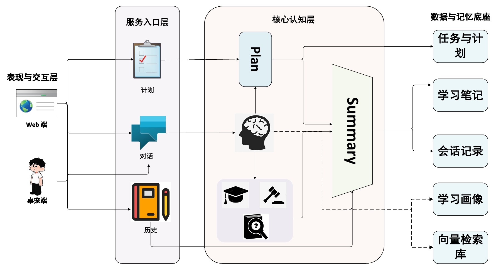

## 产品使用说明
ChatTutor 提供了“Web 全景控制台”与“沉浸式桌面宠物”双端协同的产品体验。Web 端侧重于深度学习管理与知识资产的沉淀，桌宠端则专注于打破工作流的即时陪伴与轻量交互。以下是核心功能页面的使用说明与展示：
### 1. Web 全景控制台 (Web Dashboard)
#### 1.1 聊天页
这是用户进行深度连续学习的核心主阵地。界面采用了极简且专注的对话流设计，完美支持 Markdown 富文本与 KaTeX 复杂数学公式的高亮渲染。在这里，后端的 LangGraph 多智能体引擎会在“解答（Tutor）”、“评判（Judge）”与“启发（Inquiry）”三种模式间无缝无感切换，为用户提供流畅的伴读体验。
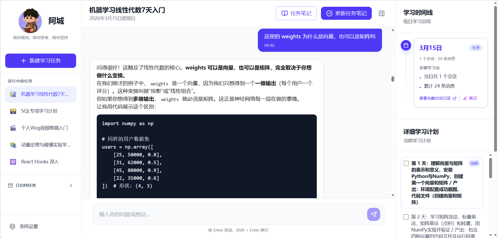
#### 1.2 学习计划页
化身你的专属“AI 滴答清单”。该页面以结构化的列表形式，全局展示当前宏大学习目标的拆解情况。用户可以清晰地看到各个子任务的层级关系、前置依赖以及当前的整体完成进度，让学习路径一目了然。
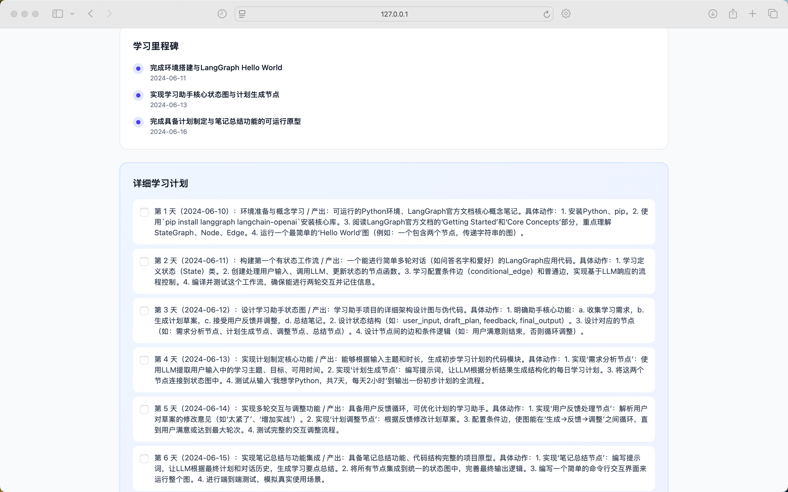
#### 1.3 学习计划更新页
计划不是一成不变的。当用户的学习状态发生改变，或在对话中提出新的诉求时，系统会动态生成或调整学习计划。在此页面，用户可以查看 AI 根据近期对答表现自动推荐的任务调整建议，并进行确认或手动微调，实现千人千面的自适应学习路径重构。
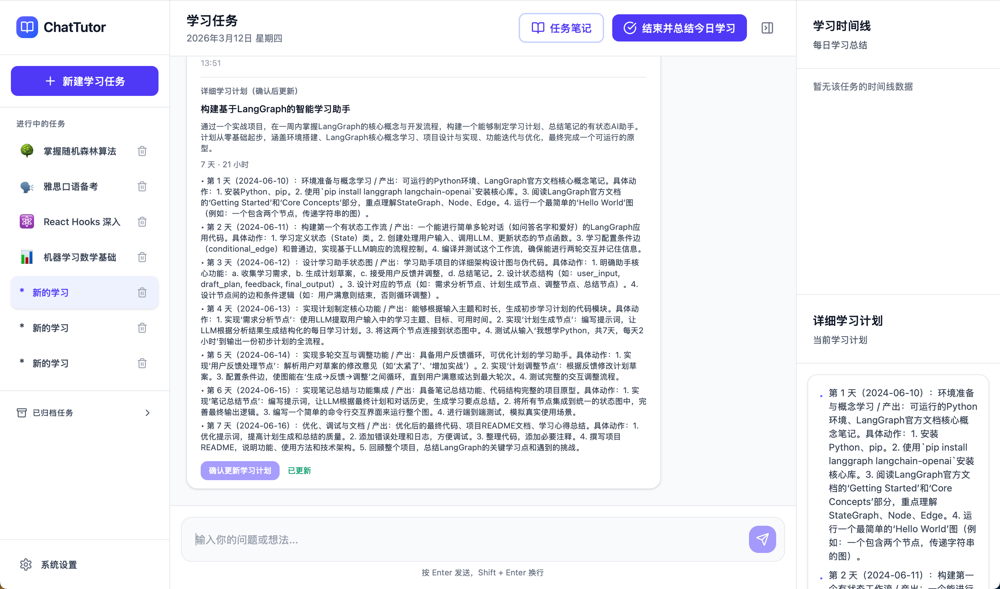
#### 1.4 任务总结页 (Task Summary Page)
告别冗长的聊天流水账，这里是用户专属的“高密度知识提炼中心”。系统会在对话推进或结束时，自动将碎片化的问答蒸馏为结构化的阶段性总结。界面中心呈现三大核心维度：
* **🧠 概念解析 (Concept Deep Dive)**：深度归纳本次会话的核心知识点。
* **💡 认知校准 (Cognitive Shift)**：这是极具教育价值的亮点功能。系统会精准记录用户的“原始理解”，并给出 AI 的“修正视角”，直观呈现认知纠偏的全过程，让进步有迹可循。
* **🚀 下一步思考 (Next Steps)**：基于当前掌握情况，智能生成后续的探究方向。
配合右侧的“每日学习时间线”与“详细学习计划”，让用户的每一次交互都能沉淀为清晰的知识资产与行动指南。
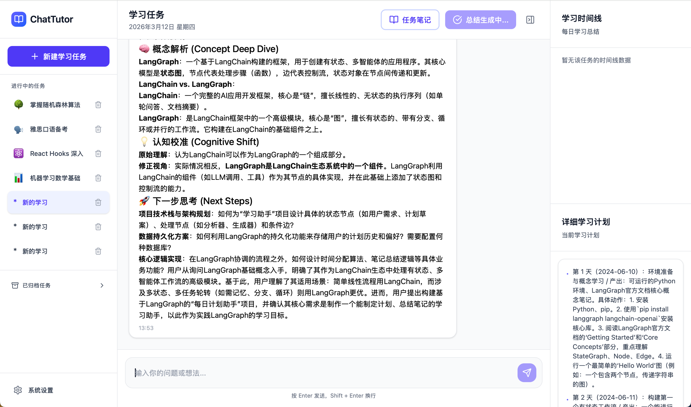
#### 1.5 学习笔记页 (Learning Notes Page)
这是用户的“私人数字知识库”，支持AI智能生成与人工自定义编撰的双轨协同模式。一方面，系统会在后台利用语义蒸馏技术，将对话中的核心概念、推导逻辑与认知纠偏自动提取并结构化排版；另一方面，用户拥有完全的自主权，可以随时手动创建新笔记、补充个人思考或对 AI 生成的总结进行深度二次编辑。通过这种“人机共创”的方式，将客观的知识沉淀与主观的个人洞察无缝融合，让用户随时查阅、检索专属的高密度知识资产，彻底告别“学完就忘”。
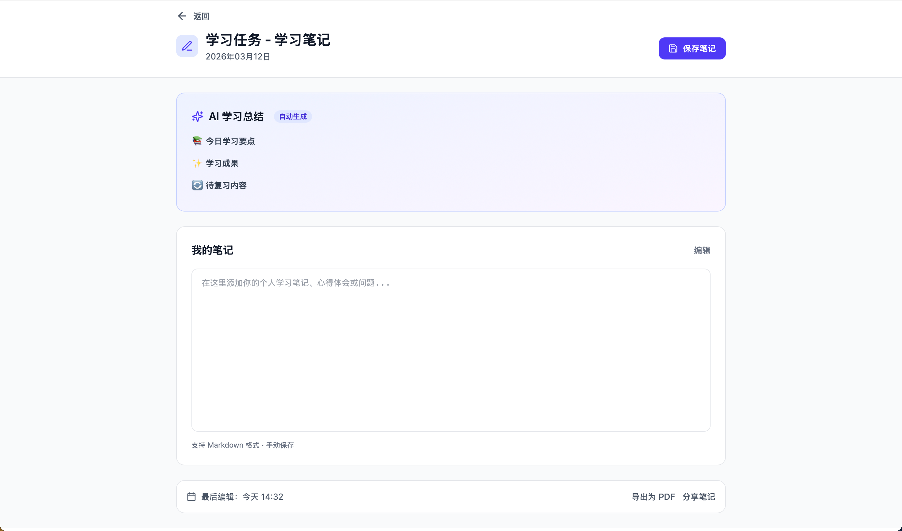
#### 1.6 任务总览与学习画像页
这里是用户“隐式能力矩阵”与“学习总盘”的可视化面板。系统会以具体的学习项目为核心，动态呈现用户的多维度能力数据：顶部直观汇聚了“学习天数”、“累计时长”与“完成进度”等全局指标；下方则精准拆解出该任务的“核心知识点”，并通过动态进度条实时呈现各项底层技能（如 Python、LangGraph 核心概念等）的“掌握程度”。配合底部的“学习里程碑”记录 ，这里不仅是数据的汇总，更是用户量化自身成长、获得学习掌控感的专属大屏。
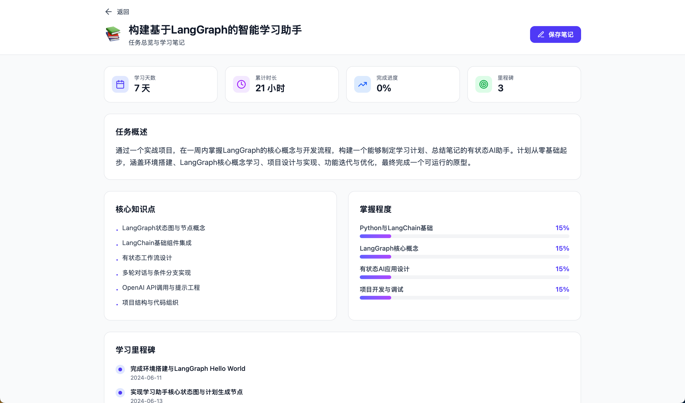
#### 1.7 私人知识图谱可视化大屏
这是 ChatTutor “将对话重塑为知识资产”这一核心理念的终极视觉形态。系统不仅在后台静默抽取实体，更在前台提供了一个极具科技感的**拓扑图谱漫游界面**。该功能将原本散落在对话中的孤立概念进行深度关联。用户能清晰查阅各个知识点（节点）及其逻辑脉络（边），见证碎片化信息如何被系统化地重塑为一套结构完整的认知框架。这种全局的“上帝视角”，帮助用户彻底告别“盲人摸象”式的碎片化学习，轻松建立系统级认知框架。
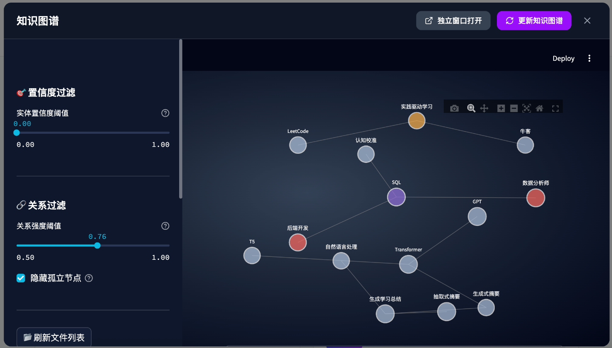

### 2. 沉浸式桌面宠物
#### 2.1 桌宠交互页
打破次元壁的系统级陪伴。桌宠不仅具有生动的待机、思考动画，还能实时感知真实的 Windows 桌面拓扑结构。它可以智能识别并稳稳“踩”在用户当前正在阅读的 PDF 或 IDE 窗口边缘。支持鼠标拖拽与重力物理模拟，真正实现“有生命力”的静默陪伴。
<div align="center">
  
  &nbsp;
  
  &nbsp;
  
</div>

<div align="center">
  
  &nbsp;
  
  &nbsp;
  
</div>
<div align="center">
  
  &nbsp;
  
  &nbsp;
  
</div>

#### 2.2 桌宠聊天页
专注于“不打断心流”的轻量化学习。用户无需频繁切屏回浏览器，只需双击桌宠即可原地唤出无边框的透明对话层；长按即可触发高保真语音输入。它就像一个坐在屏幕旁边的专属助教，让你在工作软件中实现“即看即问”的自然多任务并行。
<div align="center">
  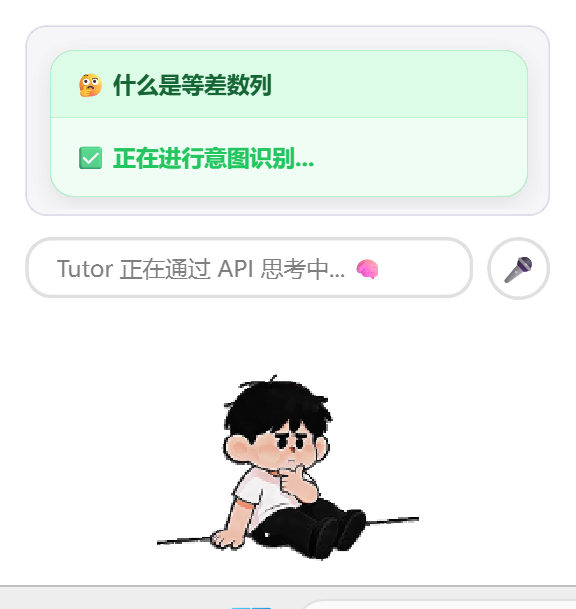
  &nbsp;
  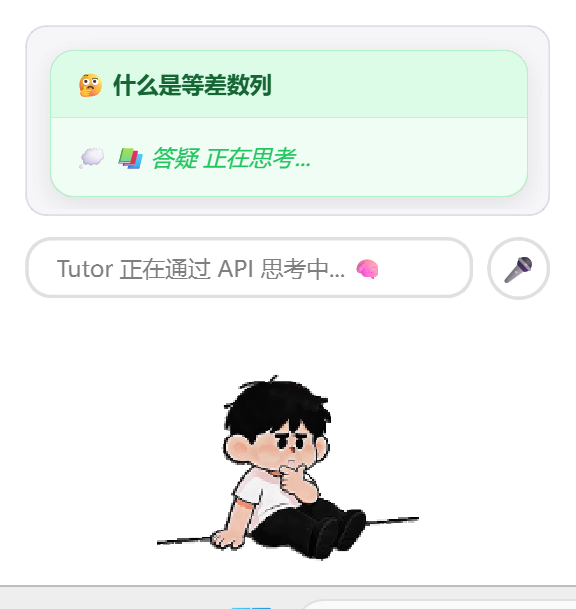
</div>
<div align="center">
  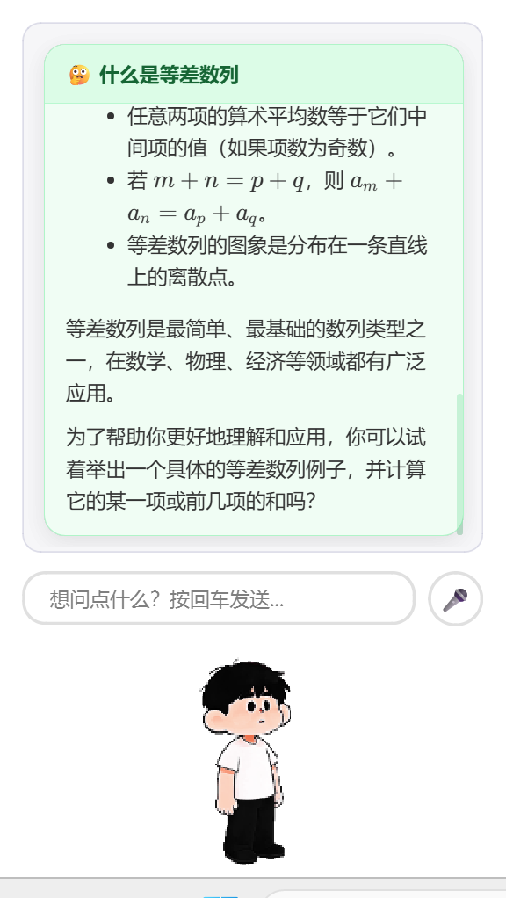
  &nbsp;
  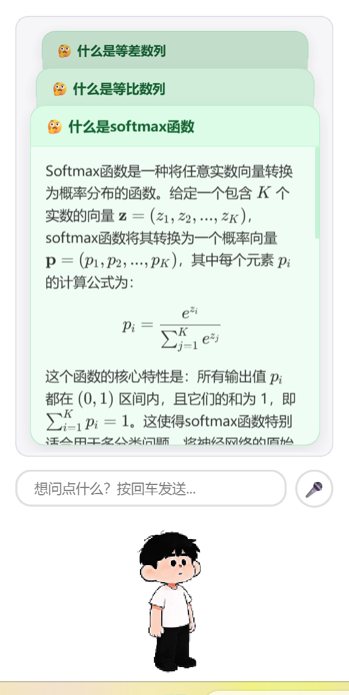
</div>

#### 2.3 快捷任务路由与双端接力
桌宠绝不是一个孤立的聊天挂件，而是通往系统全局的“任意门”。系统深度打通了轻量交互与重度管理的边界：
* **📌 右键碎片归档**：在桌宠上右键点击，即可唤出任务菜单，将当前随时起意的碎片化聊天**精准归属到特定的“学习任务树”中**。即便是在桌面的闲聊，也能被底层架构准确路由并沉淀为该任务的知识资产。
* **🚀 深度学习接力**：当遇到需要长文本阅读或复杂图谱查阅的场景时，只需一键点击，即可从桌宠**无缝穿越至 Web 全景控制台**。云端状态实时同步，上下文绝不断档，完美实现“桌面端启发灵感，Web 端深度研读”的跨端心流接力。

<div align="center">
  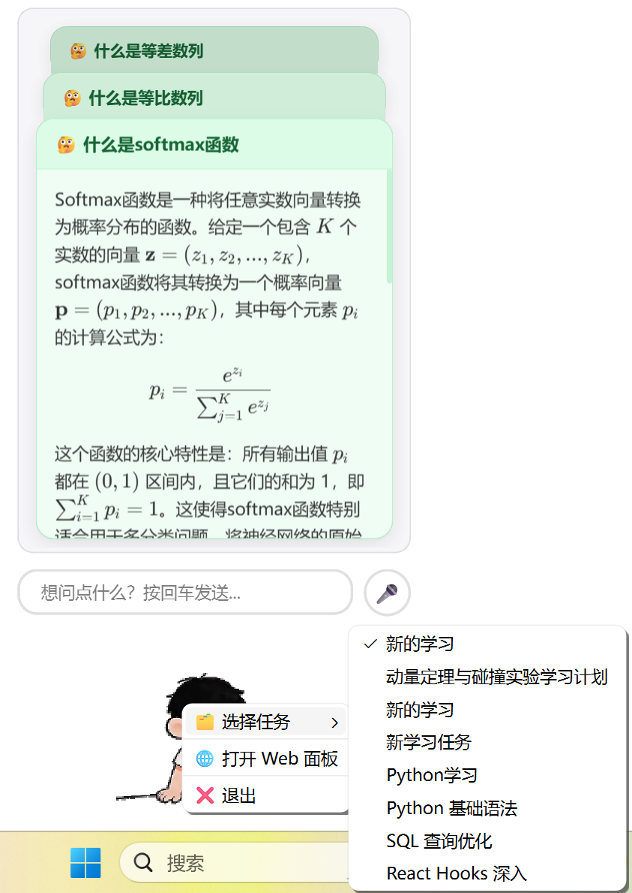
  &nbsp;
  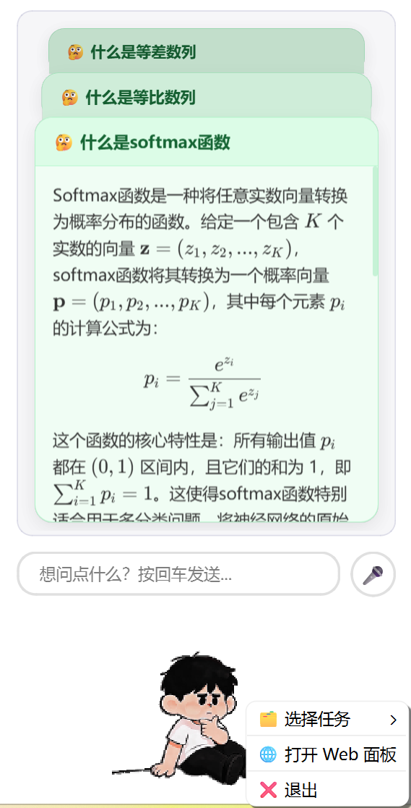
</div>


## 🛠️ 安装与配置

### 1. 克隆仓库
```bash
git clone https://github.com/DjTaNg-404/ChatTutor.git
cd ChatTutor
```

### 2. 环境准备
推荐使用 Python 3.10+。
```bash
python -m venv venv
source venv/bin/activate  # Windows: venv\Scripts\activate
pip install -r requirements.txt
```

### 3. 配置密钥 (.env)
复制 `.env.example` (如果存在) 或创建 `.env` 文件，填入以下必要信息：
```ini
# Core LLM Provider
DEEPSEEK_API_KEY=sk-xxxxxxxxxxxxxxxx

# Search Tool (Optional)
BAIDU_API_KEY=xxxxxxxxxxxx
```

## 🚀 运行指南 (Usage)

### 启动后端 FastAPI 服务
在项目根目录执行：
```bash
uvicorn app.main:app --host 127.0.0.1 --port 8000 --reload
```

启动后可访问：
- API 根路径: `http://127.0.0.1:8000/`
- Swagger 文档: `http://127.0.0.1:8000/docs`

### 启动 Web Dashboard 前端（React + Vite）
在新终端中进入前端目录并安装依赖：
```bash
cd Design_Web_Dashboard
npm install
```

启动开发服务器：
```bash
npm run dev -- --host 127.0.0.1 --port 5173
```

启动后访问：
- Dashboard 首页: `http://127.0.0.1:5173`

> 注意：请先确保后端 FastAPI 已启动，否则前端后续联调接口时将无法访问 API。

## 技术架构概述

### 总体架构分层

本系统采用了经典的端云结合与多端分离分层技术架构设计。我们将重度交互的前端体验与高耗能的云端认知引擎彻底解耦，这不仅保障了桌面端极低的资源占用，更使系统具备了极高的可扩展性，能够完美支撑连续学习场景下的长效运行。

整个系统自上而下划分为四个核心层级：
* **🖥️ 表现与交互层 (Presentation Layer)**：双端协同互补。Web 端基于 `React + Vite` 构建响应式全景控制台；桌宠端基于 `PyQt6` 打造沉浸式桌面伴读。
* **🔌 接口与服务入口层 (API Gateway)**：采用 `FastAPI` 构建高并发的统一后端服务接口，负责将多端请求标准化并路由至底层能力模块。
* **🧠 核心认知层 (Cognitive Engine)**：系统的“智慧中枢”。彻底抛弃单体黑盒模型，基于 `LangGraph` 构建多角色协作式 Agent 工作流，动态调度大模型完成意图分析、启发答疑与计划生成。
* **💾 数据与记忆底座 (Data & Memory)**：以轻量化的本地 `JSON`、`Markdown` 配合基于 ChromaDB 的 `向量检索库` 为主，稳固支撑系统的三层级联记忆、图谱构建与知识沉淀。

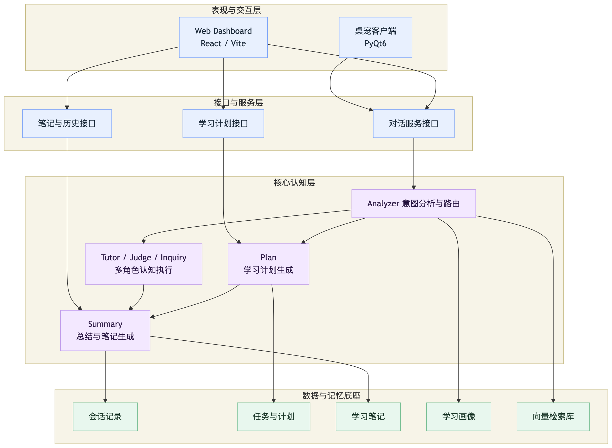


在整体运行中，用户从双端发起的非结构化请求，会经由统一网关进入核心认知模块，完成“意图识别 -> 任务路由 -> 结果生成”的完整闭环，最终将学习过程沉淀到会话、计划、笔记、画像与检索库等底层数据结构中。通过这样的分层组织方式，ChatTutor 不再只是一个单轮问答工具，而是一个能够围绕学习过程进行持续组织与管理的智能学习系统。

### 核心模块组成

| 模块层级           | 核心组成                                             | 主要职责                                                     | 对应价值                                         |
| ------------------ | ---------------------------------------------------- | ------------------------------------------------------------ | ------------------------------------------------ |
| 表现与交互模块     | Web Dashboard、桌宠客户端                            | 提供用户学习入口，承载任务管理、学习对话、历史查看与笔记回顾等交互功能 | 支持多终端接入，提升学习场景的灵活性与陪伴感     |
| 接口与服务入口模块 | 对话服务接口、学习计划接口、笔记与历史接口           | 统一接收不同终端的请求，并将其路由至后端对应能力模块         | 解耦前端交互与后端智能处理逻辑，提升系统可扩展性 |
| 核心认知模块       | Analyzer、Tutor、Judge、Inquiry、Plan、Summary       | 完成意图识别、任务路由、知识讲解、理解评估、追问引导、计划生成与总结输出 | 支撑系统从单轮问答走向连续式学习陪伴             |
| 数据与记忆模块     | 会话记录、任务与计划、学习笔记、学习画像、向量检索库 | 保存学习过程中的关键状态与历史数据，并支持上下文增强与长期沉淀 | 实现长期学习追踪、个性化支持与学习资产积累       |

#### 表现与交互模块

表现与交互模块是系统面向用户的入口层，主要由 Web Dashboard 与桌宠客户端构成。其中，Web Dashboard 承担任务管理、学习对话、学习计划生成、历史查看与笔记回顾等核心功能，是当前任务化学习流程的主要承载端；桌宠客户端则基于 PyQt6 实现，以轻量、常驻和陪伴式的方式提供桌面交互体验，更适合融入日常学习环境。两种交互形态虽然面向的使用场景不同，但共享同一套后端服务和智能能力，从而保证了系统体验与学习数据的一致性。

#### 接口与服务入口模块

接口与服务入口模块是系统的统一接入层，负责承接来自不同终端的请求，并将其分发到对应的后端能力模块中。当前系统主要提供三类服务入口，包括对话服务接口、学习计划接口，以及笔记与历史接口。其中，对话服务接口负责支持学习过程中的实时问答与交互；学习计划接口负责生成、确认与更新学习计划；笔记与历史接口则用于学习记录的查询、回看与沉淀管理。该模块的核心作用在于屏蔽前端交互差异，将用户请求统一转换为后端可处理的业务流程，从而实现表现层与智能处理逻辑的有效解耦。

#### 核心认知模块

核心认知模块是 ChatTutor 的智能中枢，也是其区别于传统问答系统的关键所在。系统首先通过 Analyzer 对用户输入进行意图识别与任务路由，再由 Tutor、Judge、Inquiry 等不同认知角色分别承担教学答疑、理解评估与追问引导等职责；当用户进入任务化学习场景时，Plan 模块进一步负责学习计划的生成与调整；而 Summary 模块则负责将学习过程整理为阶段性总结与笔记内容。通过这种分工式的认知架构，系统能够将一次普通的对话交互扩展为面向学习过程的连续支持，使问答、诊断、引导与规划形成有机协同。

#### 数据与记忆模块

数据与记忆模块构成了系统的底层支撑，也是 ChatTutor 能够实现长期学习陪伴的重要基础。该模块主要包括会话记录、任务与计划、学习笔记、学习画像以及向量检索库等数据对象。其中，会话记录用于保存完整的学习对话过程，任务与计划用于组织长期学习目标与阶段安排，学习笔记用于沉淀结构化学习成果，学习画像用于刻画学习者的偏好、状态与认知特征，向量检索库则用于支持历史内容召回与上下文增强。通过这一底层模块，系统不仅能够完成即时回复，还能够持续积累学习过程数据，为后续的个性化引导、上下文保持与学习沉淀提供支撑。

### 系统主流程与数据流转

ChatTutor 的主流程并不是一次简单的“输入问题 - 返回答案”过程，而是围绕学习任务展开的连续式认知处理链路。在系统运行中，用户既可以通过 Web Dashboard 发起任务化学习，也可以通过桌宠客户端进入轻量对话场景；但无论入口如何变化，其后端处理逻辑始终遵循统一的数据流转机制。整体来看，系统的数据流转可以概括为“请求接入 - 状态恢复 - 意图路由 - 认知执行 - 结果生成 - 学习沉淀”六个阶段。

以一个典型场景为例：用户在 Web 端进入某个学习任务，并发送一条新的学习问题。请求首先进入后端对话接口，系统会根据当前请求中的任务标识与会话标识确定本次对话所属的任务上下文。如果用户已经存在历史会话，系统会从本地存储中恢复该任务下的历史消息、会话摘要以及已压缩的上下文状态；如果是新的学习任务，则会初始化一条新的会话记录，并建立对应的任务上下文。至此，用户输入不再被视为孤立问题，而是被纳入某个持续演进的学习过程之中。

在完成会话状态恢复之后，系统会将最新用户消息追加到当前状态中，并交由核心认知模块进行分析。首先，Analyzer 会结合用户最新输入、历史对话、上下文摘要以及当前任务状态，判断本轮请求属于哪一种类型，例如知识问答、理解评估、追问引导、即时总结或学习计划生成等。这个阶段本质上是整个系统的任务路由中枢，它决定了当前请求是进入普通答疑链路，还是进入学习计划链路，抑或触发总结与沉淀逻辑。

当用户请求属于普通学习对话时，系统会进入多角色协作式认知执行阶段。根据 Analyzer 的判断结果，Tutor、Judge 与 Inquiry 等不同角色会被选择性激活。Tutor 负责对用户问题进行结构化讲解与知识解释；Judge 负责识别用户理解中的偏差、漏洞或不完整之处；Inquiry 则负责基于当前对话状态提出进一步的启发式问题，以推动学习过程从“获得答案”走向“形成理解”。在这一过程中，系统不会直接把完整历史一并送入模型，而是先通过上下文引擎完成上下文拼装：一方面保留最近若干轮原始对话作为短期工作记忆，另一方面加载长期摘要作为认知链压缩结果，同时结合历史检索机制，从旧会话中召回与当前问题相关的片段，用于增强模型对长期学习轨迹的感知能力。

在各个认知角色完成本轮执行后，系统会进入结果汇总阶段。Aggregator 会综合 Tutor、Judge、Inquiry 以及计划或总结模块的输出，将多个子结果组织为一条连贯的最终回复。如果用户此时触发的是即时总结请求，系统会调用总结生成模块对当前对话进行压缩整理，并直接以总结结果作为回复内容；如果用户表达的是结束学习的意图，则系统会生成一份更完整的会话总结，并将其作为阶段性学习产出返回给用户。因此，系统的最终输出并不固定为某一类响应，而是会根据当前学习状态动态调整其输出形式。

在生成最终回复后，系统会立即进入学习过程沉淀阶段。首先，本轮完整消息会被写回会话存储，用于保存连续对话历史；随后系统会检查当前未压缩消息数量是否超过阈值，若达到条件，则自动触发摘要压缩，将旧消息整合为更高密度的上下文摘要，并更新压缩游标。与此同时，系统还会从本轮用户输入与模型回复中抽取能够反映学习目标、理解状态、偏好和进展的信息，更新学习画像；对话内容也会被索引到向量检索库中，以便后续轮次进行历史召回。这意味着一次对话完成后，系统不仅得到了“当前回答”，还同步更新了后续学习所依赖的长期状态。

当用户进入任务化学习场景时，系统还会在主链路之外扩展出学习计划相关的数据流转逻辑。一方面，用户可以通过 Web 端直接调用学习计划接口，根据目标、当前水平与时间安排生成初始学习计划；另一方面，在自然对话过程中，Analyzer 也可以识别用户的计划意图，并将请求路由到计划模块。生成后的学习计划会被保存为任务级结构化数据，并在后续学习过程中持续参与上下文组织与任务推进，从而使系统从“回答问题”进一步延伸为“组织学习过程”。

此外，当用户完成某一阶段学习或结束一次会话后，系统会进一步将对话过程沉淀为笔记与总结内容。会话级总结会进入笔记存储，用于形成可回顾的学习记录；任务级笔记则用于汇总更长期的学习进展；若需要更进一步的知识可视化，系统还可以在后台基于完整会话内容构建知识图谱输出。通过这一机制，用户在系统中的学习行为会逐步形成由会话、任务、笔记、画像与知识结构共同构成的长期学习资产。

总体而言，ChatTutor 的系统主流程并不是围绕单次回答构建的，而是围绕“学习状态持续更新”这一目标展开的。每一次输入既是一次新的请求，也是对既有学习过程的延续；每一次输出不仅服务于当前交互，也会反向更新系统对用户、任务与上下文的理解。正是通过这样的数据流转方式，系统得以从传统问答工具演进为面向长期学习过程的智能学习助手。

| 阶段     | 系统动作                                                     | 输出结果                       |
| -------- | ------------------------------------------------------------ | ------------------------------ |
| 请求接入 | 接收来自 Web Dashboard 或桌宠客户端的用户输入，并识别当前任务与会话上下文 | 形成当前请求的基础状态         |
| 状态恢复 | 从本地存储中读取历史消息、上下文摘要、任务状态与相关学习数据 | 重建本轮对话所需的学习上下文   |
| 意图路由 | 由 Analyzer 对用户输入进行分析，判断属于问答、评估、追问、总结还是计划生成等场景 | 确定后续执行链路               |
| 认知执行 | Tutor、Judge、Inquiry、Plan 等模块按需激活，分别完成知识讲解、理解评估、启发引导与计划生成 | 生成多个认知子结果             |
| 结果生成 | Aggregator 对各模块输出进行整合，生成最终回复；必要时触发 Summary 模块输出总结 | 返回面向用户的最终响应         |
| 学习沉淀 | 将本轮结果写回会话记录，并更新摘要、学习画像、任务计划、笔记内容与向量检索索引 | 完成学习状态更新与长期数据沉淀 |

## 核心功能技术

### Agent 架构编排

为了更贴合真实学习场景，ChatTutor 并未采用“单模型 + 单提示词”的传统问答方式，而是基于 LangGraph 构建了多角色协作式 Agent 架构。在学习过程中，用户的需求并不总是单一的知识提问，还可能包含理解表达、追问引导、学习计划生成与阶段性总结等多种任务。因此，系统首先通过 Analyzer 对用户输入进行意图识别与任务路由，再由 Tutor、Judge、Inquiry、Plan、Summary 等模块分别承担教学答疑、理解评估、启发引导、计划生成与总结沉淀等职责，最终通过 Aggregator 将各模块结果整合为统一回复。

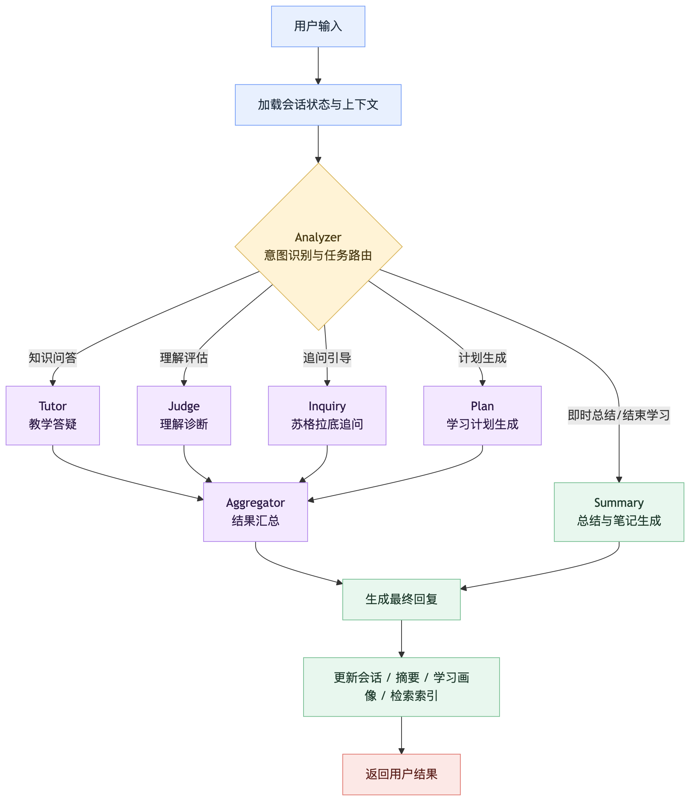

这种编排方式使系统能够根据不同学习阶段动态切换支持策略，从而将传统的单轮问答扩展为面向长期学习过程的连续认知支持。其优势在于任务分工更加明确、输出行为更加可控，同时也为后续引入新的认知模块和学习能力提供了良好的扩展空间。

| 节点       | 主要职责                                           | 在学习场景中的作用                                   |
| ---------- | -------------------------------------------------- | ---------------------------------------------------- |
| Analyzer   | 对用户输入进行意图识别，并决定后续进入哪条处理链路 | 充当系统的任务路由中枢，决定当前最需要的学习支持方式 |
| Tutor      | 对知识点进行讲解、解释与结构化回答                 | 帮助用户理解概念、原理与方法，是教学输出的核心节点   |
| Judge      | 对用户的理解、复述或回答进行评估与诊断             | 帮助发现认知漏洞、逻辑偏差或掌握不完整之处           |
| Inquiry    | 基于当前对话状态提出进一步问题                     | 通过追问推动用户从“听懂”走向“想清楚”                 |
| Plan       | 根据用户目标、任务状态和上下文生成或调整学习计划   | 支持系统从自由问答扩展到任务化学习组织               |
| Summary    | 在即时总结、结束学习等场景下生成总结与笔记内容     | 将学习过程沉淀为可回顾、可积累的阶段性成果           |
| Aggregator | 对多个认知模块输出进行整合，生成统一回复           | 保证系统最终输出在语义和表达上的连贯性与一致性       |

### 对话上下文与记忆机制

在学习场景中，系统需要记住的并不仅是用户说过什么，更重要的是用户已经学到了哪里、哪些知识点仍然模糊，以及当前问题与过往讨论之间的关系。为此，ChatTutor 并未简单地将完整历史对话一次性输入模型，而是采用了分层式的上下文组织机制，将上下文记忆拆分为短期工作记忆、摘要压缩长期认知链与关联历史召回三部分。通过这种方式，系统既能够保持当前对话的即时连贯性，又能够在更长时间跨度上维持学习过程的连续性。


在具体实现上，系统会保留最近若干轮原始消息作为短期工作记忆，用于支撑当前交互；当历史消息累计到一定阈值后，系统会自动触发摘要压缩，将较早阶段的对话提炼为高密度认知摘要；与此同时，系统还会根据当前问题，从历史记录中召回最相关的旧片段作为补充上下文。当前实现中，历史召回优先采用基于向量检索的语义匹配机制，并在必要时回退到轻量级相似度匹配方法。通过这种“窗口 + 摘要 + 召回”的组合方式，ChatTutor 得以从传统的短时对话记忆扩展为面向长期学习过程的上下文支撑系统。

| 记忆层级     | 实现方式                               | 主要作用                                                 | 当前实现特点                                                 |
| ------------ | -------------------------------------- | -------------------------------------------------------- | ------------------------------------------------------------ |
| 短期工作记忆 | 保留最近若干轮原始消息                 | 维持当前对话的连贯性，支持指代消解与即时上下文理解       | 当前默认保留最近 12 条消息                                   |
| 长期认知链   | 在阈值触发后对旧对话进行摘要压缩       | 记录学习过程中的核心认知脉络，减少长对话带来的上下文膨胀 | 当前在未压缩消息达到阈值后自动更新摘要，并保留最近 5 条消息不参与压缩 |
| 关联历史召回 | 基于向量检索优先、轻量级相似度匹配兜底 | 在当前问题与旧对话相关时，主动补充历史背景信息           | 当前优先使用语义检索，并在必要时回退到 Jaccard 相似度匹配    |
| 持续状态更新 | 会话写回、本地存储、向量索引更新       | 将每轮对话转化为后续学习可用的长期状态                   | 当前每轮对话结束后自动保存会话并更新检索索引                 |

### 学习计划与计划生成机制

ChatTutor 并不将学习对话仅仅视作零散的问题响应，而是进一步将其组织为可持续推进的任务化学习过程。为此，系统在普通对话链路之外，引入了学习计划生成机制，使用户能够从“随时发问”过渡到“围绕明确目标持续学习”。这一机制既支持用户在 Web 端显式创建学习任务并生成计划，也支持系统在自然对话过程中识别用户的计划意图，并将请求路由到计划生成链路，从而实现从自由问答到目标驱动学习的平滑过渡。

在具体实现上，系统以 task_id 和 session_id 作为任务与会话的基本组织单元。task_id 用于标识长期学习目标，session_id 用于区分某一任务下的具体对话过程。当用户提出学习目标、时间安排或阶段要求时，系统会结合当前对话历史、任务状态与上下文摘要生成结构化学习计划，并将结果保存为任务级数据。该计划不仅作为一次性输出展示给用户，还会在后续对话中持续参与任务推进、上下文组织与学习沉淀，使系统能够围绕同一目标形成连续的学习支持，而不是停留在割裂的单轮交互层面。

### 会话历史、笔记与学习沉淀机制。

ChatTutor 将每一次对话都视为一次真实的学习过程，因此系统不仅关注当前轮次的回复质量，也重视学习过程本身的记录、整理与沉淀。在这一设计下，系统以“对话”为最小学习单元，以“天”为阶段性归档单位，以“任务”为长期目标单位，将原始交互逐步组织为可回看、可整理、可积累的学习资产。通过这种方式，用户在系统中的学习行为不会随着单轮对话结束而消失，而会持续沉淀为结构化的历史记录与学习笔记。

在具体实现上，系统会首先保存完整的会话消息，用于支持历史回看与后续上下文恢复；当用户请求即时总结或结束当前学习时，系统会进一步生成阶段性总结内容，并将其归档为学习笔记；同时，系统还支持按任务维度聚合历史会话与任务笔记，使用户能够从长期视角回顾某一学习主题下的整体进展。这样一来，会话历史承担的是“记录学习过程”的功能，笔记承担的是“提炼学习成果”的功能，而任务级沉淀则进一步将碎片化的对话整合为可持续追踪的学习路径。

### 学习画像与知识扩展机制

为了让系统不仅“记住对话”，还能够逐步理解“这个学习者是谁、当前处于什么状态、学过什么内容”，ChatTutor 在基础会话记忆之外，进一步设计了学习画像与知识扩展机制。其中，学习画像主要用于刻画学习者的长期特征，例如学习目标、偏好表达方式、薄弱知识点与阶段性进展；知识扩展机制则用于把对话内容进一步转化为更高层次的知识结构，以支持长期分析、回顾与可视化展示。两者共同作用，使系统从“围绕一轮对话响应”进一步发展为“围绕长期学习者状态组织支持”。

在当前实现中，系统会在每轮对话结束后，从用户输入与模型回复中抽取能够反映学习状态的关键信息，并将其更新到学习画像中；随后在下一轮对话构建提示词时，再将画像摘要重新注入模型上下文，用于增强个性化响应能力。与此同时，系统还支持在会话结束或用户需要时，基于完整会话历史构建知识图谱，将对话中的实体、概念与关系进一步组织为结构化知识表示。前者偏向“理解学习者”，后者偏向“理解学习内容”，共同构成了系统的长期认知增强能力。

### 数据存储与管理机制

作为一个面向长期学习过程的智能系统，ChatTutor 不仅需要完成即时对话生成，还需要对任务状态、历史记录、学习笔记、学习画像与检索索引进行持续管理。因此，系统在当前阶段采用了以本地文件为核心的数据存储方案，将不同类型的数据按用途进行分层组织，以支撑会话恢复、任务推进、学习沉淀与上下文增强等核心功能。这样的设计虽然属于 MVP 阶段的轻量实现，但已经能够支撑完整学习闭环的运行。

在具体实现上，系统会将会话数据保存为结构化 JSON 文件，用于恢复完整历史消息与上下文状态；任务计划与任务索引用于维护长期学习目标及其组织关系；学习笔记与总结内容以 Markdown 或结构化任务数据形式保存，便于查看和编辑；学习画像则以结构化卡片数据单独存储，用于支撑个性化能力；与此同时，向量检索相关索引也会按任务维度进行维护，以支持历史召回与语义增强。通过这种按功能拆分的数据管理方式，ChatTutor 能够在不依赖复杂数据库系统的前提下，实现从实时对话到长期学习沉淀的完整状态管理。

## 多终端交互形态

### Web 端技术实现

Web 端是 ChatTutor 当前最完整的学习工作台形态，也是任务化学习流程的主要承载入口。系统基于 React 与 Vite 构建前端应用，通过路由化页面组织对话、任务、历史与笔记等核心功能，使用户能够在一个统一界面中完成学习任务创建、持续对话、学习计划查看、历史回顾与笔记沉淀等操作。相较于轻量交互入口，Web 端更适合承载结构化、持续性的学习过程，因此在当前产品形态中承担了更强的任务组织与长期管理职责。

在具体实现上，Web 端并不是一个单纯的聊天页面，而是围绕学习任务构建的前端工作流。用户可以在任务侧边栏中切换不同学习主题，在对话页面中围绕同一任务持续交流，在历史页面回看既往会话，并在每日笔记与任务笔记页面中整理阶段性成果。前端通过统一调用后端接口，将对话、计划、历史、笔记等能力整合为一条完整的学习链路，从而使 Web 端不仅负责信息展示，也承担了学习过程组织与结果沉淀的重要功能。

### 桌宠端技术实现

与 Web 端相比，桌宠端承担的是一种更轻量、更陪伴式的交互形态。系统基于 PyQt6 构建桌面客户端，通过悬浮窗、输入框、动态状态切换和桌面行为反馈等机制，将 ChatTutor 从浏览器中的学习工具延伸为常驻桌面的学习伙伴。这样的设计使系统能够更自然地融入日常学习环境，适合承接碎片化提问、即时确认与轻量互动等场景。

在实现逻辑上，桌宠端并没有独立维护一套智能能力，而是通过统一的后端接口复用与 Web 端相同的对话服务能力。桌宠客户端主要负责输入采集、状态展示与桌面交互控制，而真正的意图分析、认知执行与学习状态更新依然由后端统一处理。与此同时，桌宠还加入了拖拽、掉落、待机、思考等状态反馈机制，使系统在功能之外具备一定的交互趣味性和陪伴属性。这种设计既增强了产品的可感知性，也避免了多端能力分裂的问题。

### 多端统一后端架构的价值

ChatTutor 的多端设计并不是分别开发两套独立系统，而是围绕同一套智能后端能力构建不同交互入口。无论用户是通过 Web 端进行任务化学习，还是通过桌宠端进行轻量提问，其请求都会进入统一的后端服务，并共享同样的任务状态、会话历史、学习计划、笔记沉淀与上下文记忆机制。这样一来，系统能够在不同终端之间保持学习状态的一致性，使多端体验不再是割裂的功能集合，而是对同一学习过程的不同承载方式。

这种统一后端、多端接入的架构设计具有明显的产品和工程优势。从产品层面看，Web 端适合深度学习和长期管理，桌宠端适合高频陪伴和即时互动，两者形成了互补关系；从工程层面看，统一后端减少了能力重复建设，提高了系统维护性，也为未来扩展更多交互形态预留了空间。正因如此，ChatTutor 的多端设计并不是简单的界面扩展，而是围绕同一学习智能系统进行交互形式创新的一种实现方式。