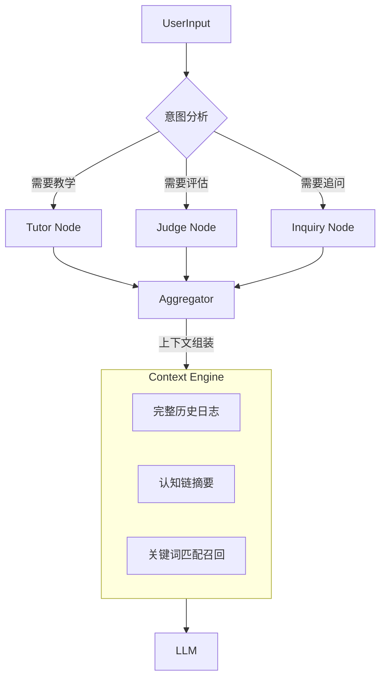

# ChatTutor：一场对话，即是一次学习

> **“一场对话，就是一次学习。”**

## 产品简介

ChatTutor 是一款定位于个人学习上的陪伴型导师 Agent。产品的核心理念为“一场对话，即是一次学习。”我们把每场和 ChatTutor 的对话都看作是一次学习过程，在这过程中 ChatTutor 既能作为专业的 Tutor 来对你的问题进行回答，也能作为和你共同学习的同行，提出深入、有见解的问题一起思考，引导你更深刻、全面地进行学习。


## 灵感来源

为何要做 ChatTutor？其实更多的需求都是通过身边的经历所发现的。

### 1. 入门大模型的经历

在我本人入门大模型的过程中，实际上也是脱离不开大模型的。当我们在看开源学习资料、相关论文、博客的过程中，如果出现了不懂的概念，都会通过去和大模型进行交流，来让大模型来回答自己的问题。同时自己在学习的过程中，更喜欢将自己对于一些知识的理解，用自己的话总结并复述给大模型，让大模型来判断我的理解是否正确，从而正确地进行学习。

基于我学习的方式，因此产生了做一个专注于个人教育过程的 Agent 的想法。虽说现在通用大模型都可以具备对应能力，但是反复通过复制 Prompt 模版来引导通用大模型按照我们预想的方式进行交流是一件反复而无义的事情。既然自己本身有设计、实现 Agent 的能力，不如就自己设计一个对应的产品，先服务于自己。做产品，首先自身有痛点，产品能解决自身的痛点。同时作为自用的产品，自己也是第一个客户，能够从“设计者”到“使用者”更好地提升产品。

### 2. 苏格拉底学习法

对于学习法，以前只听说过费曼学习法，即将自己学到的知识复述并教会他人来进行学习。在和同学交流时，同学转发了晓辉博士的视频，视频里介绍了苏格拉底学习法。苏格拉底学习法，也被称为“精神助产术”或“问答法”，即一种通过对话和提问来引导思考、揭示认知矛盾，最终让学习者自己发现真理的教学方法。

我非常赞同这一种学习方法，回顾自己的学习过程，在大模型的加持下，这相当于就转换了一种教学-学习身份。以前都是我来提问或阐述观点，让大模型来解答和判断。这时加入苏格拉底学习法，运用大模型的语义理解能力和推理能力，可以在交流中更好地抓住我们的回答里的一些漏洞，亦或者发掘出我们仍并未了解的角度，接着在通过对话、提问的方式，帮助我们找到知识的漏洞并更全面地进行学习。

### 3. 相同定位的产品体验

在这一类教育类的产品中，我觉得做得最好的就是谷歌公司的 NoteBookLM。我觉得这就是未来工具的交互形式，更多地以“对话”为重点，并附加以各种工具，例如总结成卡片、思维导图等辅助我们学习。此外，NoteBookLM 还有强大的 Deep Research 能力，通过上网检索相关文献，亦或者自行上传文献，再凭借着强大的 RAG 检索能力，能够更好的结合起来解决学习问题。因此这是一个很好的产品。

但是传统的大模型产品也有缺点：传统大模型像一个搜索引擎，只负责单向输出信息。但是往往看懂答案不等于掌握了知识，所以为了让 AI 扮演好的导师角色，用户需要反复调试复杂的 Prompt。而且学习者很难判断自己是否真的理解了，缺乏一个能够通过追问来检验其认知漏洞的老师。

## 技术核心

### 1. 以 LangGraph 框架构建的多模型协作架构

为了实现我们的产品，我们使用了 LangGraph 来构建我们的 Agent。对于场景中，ChatTutor 定义了三种核心行为模式，根据用户的输入意图进行状态流转：

- **导师模式（Tutor）**：结构化输出。针对知识盲区或学习者提出的问题，提供自顶向下的概念框架与知识点拆解，并辅以正确的回答。
- **裁判模型（Judge）**：逻辑校验。当用户尝试解释概念或提出自己的观点时，调用校验逻辑识别潜在的逻辑漏洞或认知偏差。
- **探究模式（Inquiry）**：启发式追问。采用苏格拉底式发问（Socratic Method），在用户满足于表面答案时同时进行深度挖掘，逼迫其思考底层逻辑。


```mermaid
graph TD
    UserInput --> Analyzer{意图分析}
    
    Analyzer -->|需要教学| Tutor[Tutor Node]
    Analyzer -->|需要评估| Judge[Judge Node]
    Analyzer -->|需要追问| Inquiry[Inquiry Node]
    
    Tutor --> Aggregator
    Judge --> Aggregator
    Inquiry --> Aggregator
    
    subgraph MemorySystem [Context Engine]
        RawLogs[完整历史日志]
        Summary[认知链摘要]
        Recall[关键词匹配召回]
    end
    
    Aggregator -->|上下文组装| MemorySystem
    MemorySystem --> LLM
```

### 2. 工具赋能高效学习

除了三种核心行为模式外，ChatTutor 也提供了一些工具以赋能学习。

- **对话总结记录**：当学习过程中忘记当场对话前面学习了什么，可以跟模型说“总结一下刚刚讨论过什么”等带有总结意向的指令，当Agent 的 Analyzer 节点分析出意图后，便会自动调用总结模块对先前的内容进行总结并展现。
- **学习记录报告生成**：当学习结束后，可以对模型发出“谢谢你，我要结束学习了”等带有结束意图的指令，当 Agent 的 Analyzer 节点分析出对应意图后，便会自动调用学习报告生成模块对整个对话整理成学习报告并自动保存，最后并自动结束对话。
- **联网搜索**：集成了百度搜索 API，支持联网搜索带有实时性、准确的信息支持对话，并以此能够更有效进行学习。

### 3. 上下文保持长期认知连续性

为了支撑长达数小时的深度对话，ChatTutor 解决了大模型在长窗口下的“灾难性遗忘”问题，实现了真正的长期认知连续性。详细来讲，在与大模型交互的过程中，提供给大模型的信息设置为：
$$
上下文记忆=滑动窗口短期工作记忆+摘要压缩长期认知链+关联联想记忆
$$

| 记忆类型 (Memory Type)                   | 机制 (Mechanism)                         | 作用 (Function)                                              | 更新频率         |
| :--------------------------------------- | :--------------------------------------- | :----------------------------------------------------------- | :--------------- |
| **短期工作记忆**<br>(Working Memory)     | **滑动窗口**<br>(Sliding Window)         | 保留最近 **12条** 原始对话，确保即时交互流畅，解决指代消解（如“那个是什么”）。 | 实时 (Real-time) |
| **长期认知链**<br>(Cognitive Chain)      | **摘要压缩**<br>(Semantic Compression)   | 每隔 **16条** 消息，调用 LLM 将旧对话蒸馏为高密度的“认知状态摘要”，记录用户从不懂到懂的学习路径。 | 低频 (Batch)     |
| **关联联想记忆**<br>(Associative Recall) | **关键词匹配召回**<br>(Keyword-based Recall) | 当用户提问时，实时扫描**所有历史记录**（即便是100轮之前的），基于精准召回相关细节（如某个参数的具体值）。 | 按需 (On-Demand) |

## 🛠️ 安装与配置

### 1. 克隆仓库
```bash
git clone https://github.com/DjTaNg-404/ChatTutor.git
cd ChatTutor
```

### 2. 环境准备
推荐使用 Python 3.10+。
```bash
python -m venv venv
source venv/bin/activate  # Windows: venv\Scripts\activate
pip install -r requirements.txt
```

### 3. 配置密钥 (.env)
复制 `.env.example` (如果存在) 或创建 `.env` 文件，填入以下必要信息：
```ini
# Core LLM Provider
DEEPSEEK_API_KEY=sk-xxxxxxxxxxxxxxxx

# Search Tool (Optional)
BAIDU_API_KEY=xxxxxxxxxxxx
```

## 🚀 运行指南 (Usage)

### 1) 启动后端 FastAPI 服务
在项目根目录执行：
```bash
uvicorn app.main:app --host 127.0.0.1 --port 8000 --reload
```

启动后可访问：
- API 根路径: `http://127.0.0.1:8000/`
- Swagger 文档: `http://127.0.0.1:8000/docs`

### 2) 启动 Web Dashboard 前端（React + Vite）
在新终端进入前端目录并安装依赖：
```bash
cd Design_Web_Dashboard
npm install
```

启动开发服务器：
```bash
npm run dev -- --host 127.0.0.1 --port 5173
```

启动后访问：
- Dashboard 首页: `http://127.0.0.1:5173`

> 注意：前端已对接真实后端接口。请先启动后端，再启动前端。

### 3) 快速功能验证（当前版本）

#### A. 聊天接口
```bash
curl -X POST "http://127.0.0.1:8000/api/v1/chat" \
    -H "Content-Type: application/json" \
    -d '{
        "task_id": "task_1",
        "message": "请解释随机森林和决策树的差别",
        "topic": "掌握随机森林算法"
    }'
```

#### B. 历史接口（任务会话 + 会话消息）
```bash
curl "http://127.0.0.1:8000/api/v1/history/tasks/task_1/sessions"
curl "http://127.0.0.1:8000/api/v1/history/tasks/task_1/timeline"
curl "http://127.0.0.1:8000/api/v1/history/sessions/task_1__20260303__153000/messages"
```

#### C. 笔记接口（每日 + 任务）
```bash
curl "http://127.0.0.1:8000/api/v1/notes/daily?task_id=task_1&date=2026-03-03"
curl "http://127.0.0.1:8000/api/v1/notes/task?task_id=task_1"
```

#### D. 前端页面验证路径
- 任务聊天：`/task/1`
- 每日笔记：`/daily-note/2026-03-03?task_id=task_1`
- 任务笔记：`/task-note/1`
- 历史记录：`/history/2026-03-03?task_id=task_1`

### 运行记忆机制仿真测试
想亲眼看看它是如何“记住”第1轮的话，并在第20轮“召回”它的吗？运行这个脚本：
```bash
python tests/test_simulation.py
```
> 该脚本会模拟一个用户从零学习“随机森林”算法的完整过程（20轮连续对话），并实时打印内存状态、压缩游标和召回命中情况。

## 📂 项目结构

```text
ChatTutor/
├── app/
│   ├── core/
│   │   ├── agent_builder.py # LangGraph 图构建与节点逻辑
│   │   ├── context.py       # [核心] 上下文拼装、摘要、召回逻辑
│   │   ├── memory.py        # 磁盘 I/O 与持久化
│   │   ├── models.py        # Pydantic 数据模型定义
│   │   ├── prompts.py       # Prompt 模板管理
│   │   ├── tools.py         # 外部工具 (Search)
│   │   └── summary/         # 总结模块 (集成到主服务)
│   │       ├── __init__.py
│   │       ├── prompts.py   # 总结专用 Prompt
│   │       └── generator.py # 总结生成器
│   ├── api/
│   │   ├── chat.py          # 对话接口 (内置总结调用)
│   │   ├── history.py       # 历史记录接口
│   │   ├── notes.py         # 笔记接口
│   │   └── kg.py            # 知识图谱接口
│   └── utils/
├── memory/                  # 运行时数据存储 (Git Ignored)
│   ├── sessions/            # 对话 Session JSON
│   └── notes/               # 生成的 Markdown 学习笔记
├── tests/                   # 测试套件
└── requirements.txt
```

## 🧠 Memory 存储规范（v1.1，单机单用户）

本项目当前定位为本地部署、单用户使用，因此本版本规范不要求显式传入 `user_id`，统一以 `task_id` 作为业务主维度。

### 1. 设计原则

- **任务优先**：所有对话与笔记围绕 `task_id` 组织。
- **会话真相源**：聊天原始记录只在 Session 层保存一份。
- **笔记派生层**：每日笔记与任务总笔记由会话数据生成/聚合。

### 2. 标识规范（简化）

- `task_id`：任务唯一标识（必填）
- `session_id`：`{task_id}__{yyyyMMdd}__{HHmmss}`
- `message_id`：时间戳 + 随机串（或 UUID）

### 3. 存储目录规范

```text
memory/
├── sessions/
│   └── {session_id}.json
├── task_index/
│   └── {task_id}.json
└── notes/
        ├── daily/
        │   └── {task_id}/
        │       └── {yyyy-MM-dd}.md
        └── task/
                └── {task_id}.md
```

### 4. 数据结构规范

#### 4.1 Session 文件：`memory/sessions/{session_id}.json`

建议字段：

- `session_id`
- `task_id`
- `topic`
- `created_at`
- `updated_at`
- `is_concluded`
- `conversation_summary`
- `summarized_msg_count`
- `messages[]`
    - `message_id`
    - `role` (`user` / `assistant`)
    - `content`
    - `timestamp`

#### 4.2 任务索引：`memory/task_index/{task_id}.json`

建议字段：

- `task_id`
- `title`（可选）
- `session_ids[]`（按时间倒序）
- `last_session_id`
- `updated_at`

#### 4.3 每日笔记：`memory/notes/daily/{task_id}/{yyyy-MM-dd}.md`

- 唯一键：`task_id + date`
- 内容建议：核心洞察、待复习点、下一步行动、来源会话列表

#### 4.4 任务总笔记：`memory/notes/task/{task_id}.md`

- 唯一键：`task_id`
- 内容建议：全周期关键结论、里程碑、能力变化、后续计划

### 5. 写入规则

每轮对话成功后：

1. 更新当前 Session 文件
2. 更新任务索引（追加/去重 `session_id`）

会话结束（`is_concluded = true`）后：

1. 生成或更新当日 Daily Note
2. 将增量内容合并到 Task Note

> 说明：不强制“一天一个会话”。同一天可有多个 Session，由 Daily Note 统一聚合。

### 6. 查询规则（前端使用）

- 任务页：读取 `task_index/{task_id}.json` 获取会话列表
- 聊天页：按 `session_id` 读取消息
- 每日笔记页：按 `task_id + date` 读取
- 任务笔记页：按 `task_id` 读取

### 7. 最小 API 契约（后续实现建议）

`POST /api/v1/chat`：

- 请求体（建议）：
    - 必填：`task_id`, `message`
    - 可选：`session_id`, `topic`
- 响应体（建议）：
    - `reply`, `is_concluded`, `task_id`, `session_id`

## 未来计划与畅想

本项目目前处于 **Workshop / MVP (Minimum Viable Product)** 阶段，核心逻辑已验证闭环，但工程化方面仍有广阔的迭代空间。以下是我们针对 Production-Ready 目标的演进规划：

| 模块 (Module)                  | 当前实现 (Current Workshop)                | 未来规划 (Future Roadmap)                                    | 目的 (Goal)                                                 |
| :----------------------------- | :----------------------------------------- | :----------------------------------------------------------- | :---------------------------------------------------------- |
| **持久化存储**<br>(Storage)    | **JSON Files**<br>(本地文件系统)           | **PostgreSQL + SQLAlchemy**<br>(关系型数据库)                | 支持高并发读写、事务安全性及多用户数据隔离。                |
| **检索增强**<br>(Retrieval)    | **Jaccard Similarity**<br>(内存级字符匹配) | **Vector DB (Chroma/Milvus)**<br>+ Hybrid Search (Keyword + Embedding) | 提升语义理解能力，支持海量非结构化文档的检索。              |
| **服务架构**<br>(Architecture) | **FastAPI + 本地状态持久化**               | **FastAPI + Celery/Redis**<br>(异步微服务)                   | 解耦计算与 I/O，支持后台任务队列（如离线长文档摘要）。      |
| **交互接口**<br>(Interface)    | **桌宠 GUI / API 调用**                    | **Next.js / Streamlit**<br>(WebSocket 流式前端)              | 提供可视化知识图谱展示、Markdown 实时渲染及更好的交互体验。 |

## 📄 License
MIT License
