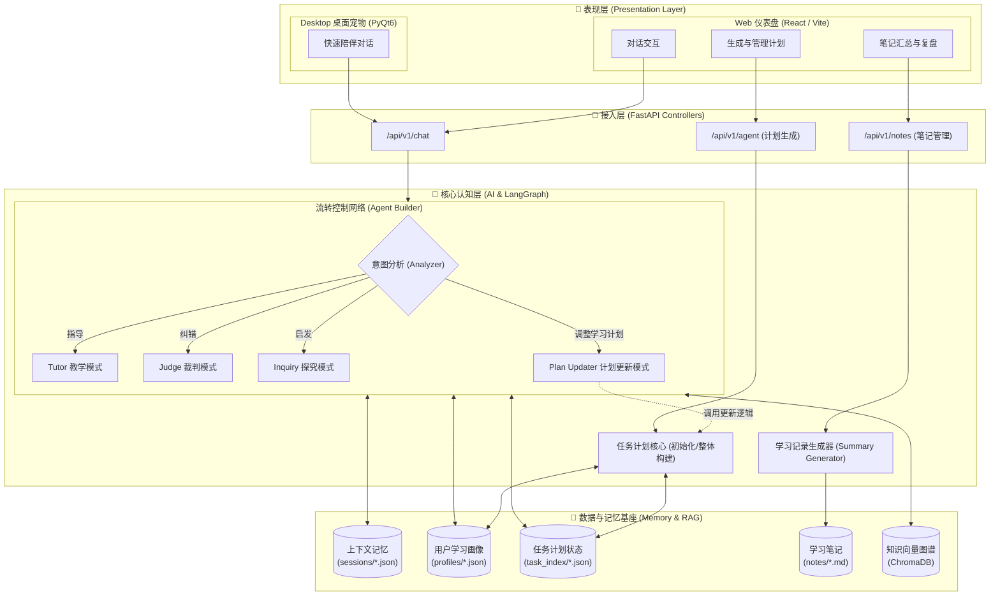
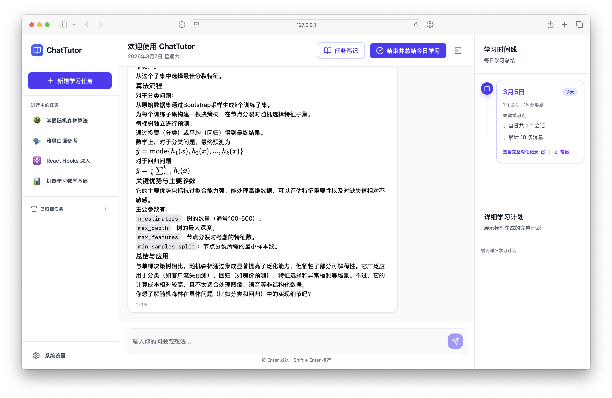
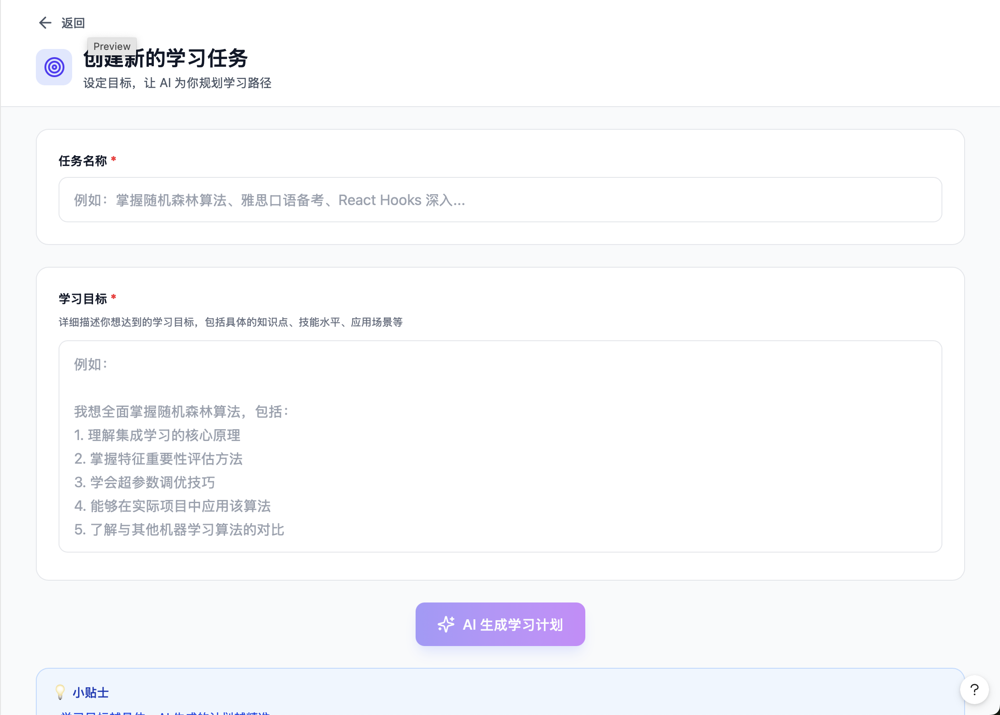
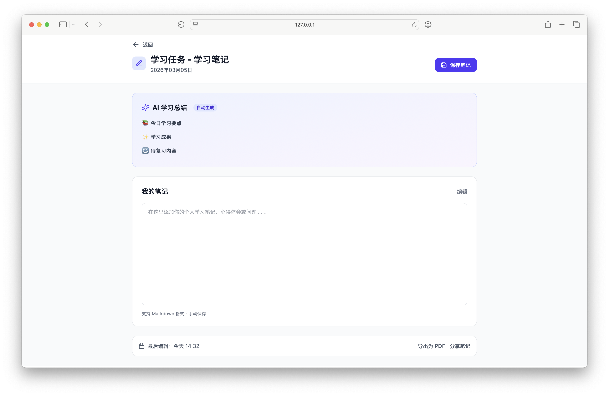
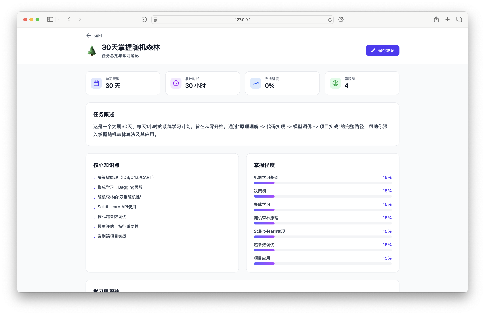

# ChatTutor 内部协作手册

## 🛠 快速开始 (快速同步环境)
- 后端: `uvicorn app.main:app --host 127.0.0.1 --port 8000 --reload`
- 前端: `npm run dev -- --host 127.0.0.1 --port 5173`
- 桌宠: `python desk_pet/code/main.py`

## 🏗 技术架构 (核心模块)



##  核心使用流程 (User Journey)
> 为了对齐前后端开发认知，以下是用户使用 ChatTutor 的标准流转路径。

1. **主页概览 (Dashboard Overview)** 🏠
   
   用户进入系统后，首屏将默认展示最近一次的对话会话。左侧导航栏用于快速切换不同的学习任务，提供连贯的学习上下文。

2. **确定目标 (Plan Init)** 🎯
   
   用户可在新建任务页创建专属学习目标。系统会根据用户的输入生成结构化的学习计划（Task Plan）。新建完成后，该任务会自动追加至主页左侧列表，相应的学习规划则会在主页右下侧面板进行可视化呈现。

3. **对话学习 (Chat & Learn)** 💬
   - 用户针对当前计划的某一节发起提问，请求路由至 `API_Chat`。
   - `Analyzer` 动态解析用户意图：
     - **求教/提问**：路由至 `Tutor` 模式，自顶向下拆解知识。
     - **表达理解**：路由至 `Judge` 模式，进行逻辑校验与纠错。
     - **认知停滞**：路由至 `Inquiry` 模式，抛出启发性问题（苏格拉底式追问）。
   - 对话产生的上下文实时持久化至 `sessions/*.json`。

4. **动态调整 (Plan Update)** 🔄
   - *(核心特性)* 当用户在对话中表达“太难了，删减掉这部分任务”或类似诉求时，触发动态调整机制。
   - `Analyzer` 识别出【修改计划】意图，将状态控制权交接给 `PlanUpdater` 节点。
   - 系统重新调度 `TaskAgent` 更新任务计划并覆盖保存，前端主动拉取最新计划视图并无感渲染。

5. **复盘沉淀 (Notes & Profile)** 📝
   - 学习告一段落时，用户可通过自然语言指令或前端按钮触发知识总结。
   - `NoteManager` 启动机制压缩对话历史，抽取出“已掌握概念”与“待复习重点”，落盘生成结构化的单次**对话总结**（`notes/*.md`）。
   - 系统会自动持久化对话总结，并将当前的学习内容脉络向上归纳至整体的**任务总结**大纲中。
   - 同步更新《用户学习画像》，持续完善用户的认知模型映射，确保 AI 在未来的交互中具备连贯的成长记忆。

   
   *(图示：单次对话维度的知识总结与提炼)*

   
   *(图示：整个学习任务维度的阶段性复盘)*

## 团队协作规则
本项目采用“总规划 + 个人日志”的协作方式。

- Development.md 作为全局对齐文档，记录产品愿景、路线图、里程碑与关键决策。
- 团队日志统一放在 docs/users/ 目录下，每位成员维护一个自己的开发日志文件（建议命名为 姓名或英文昵称.md）。
- 每次提交代码后（commit 后），需要在自己的日志中追加一条记录，说明：
  - 本次 commit 做了什么（新增功能 / 修改内容 / 修复问题）
  - 涉及的模块或关键文件
  - 影响范围或注意事项
  - 下一步计划（如有）

这些文件的目的：帮助 AI 与其他协作者快速了解当前进展与分工，降低沟通成本，加速对齐与接力开发。

以下是 commit 总结模板：

```
你是项目协作助手。请基于这次 commit 的 diff，总结本次改动并生成一条个人日志条目。
输出要求：
- 使用中文
- 结构：标题 + 4 个要点
- 要点包含：新增功能、修改点、影响范围、下一步
- 不要复述无关代码细节

请开始总结：
```
以下是开发前让大模型对齐的模版：

```
你是 ChatTutor 项目协作助手。请先阅读：
1) 项目里的所有代码
2) docs/Development.md
3) docs/users/ 下所有个人日志

目标：
- 归纳当前项目进展与进行中的版本目标
- 汇总团队成员各自负责的模块与最新进度
- 指出可能的依赖/冲突点（如前后端接口、数据结构）
- 给出我接下来开发时需要注意的上下文

请开始执行。
```

## 🗺️ 版本迭代路线 (Development Roadmap)
> 以下是 ChatTutor 接下来的开发规划，逐步实现从核心逻辑闭环到架构升级的演进。

### 第一版本：任务计划流转闭环 (当前聚焦)
- **核心目标**: 实现“新建任务”完整工作流的前后端彻底打通。
- **开发任务**:
  - 完成前端「新建任务页」的开发与交互设计。
  - 前后端联调：在新建任务时，前端请求后端调度 `Task Agent`，自动生成学习任务的计划安排。
  - 视图对接：任务生成后，在对应任务主页的右下侧区域，成功展示并渲染该学习计划大纲。
- **里程碑**: 用户生命周期中的“确定目标 (Plan Init)”阶段在实际系统中完全能够走通。

### 第二版本：桌面宠物 (Desk Pet) 全面接入
- **核心目标**: 桌宠端（Desktop Pet）基础功能大完满。
- **开发任务**:
  - 桌宠侧与后端 API 的彻底接入，实现跨端对话体验一致性。
  - 增加“右键菜单”快速切换功能：允许用户快速切换至对应的学习任务中进行对话交互。
- **里程碑**: 至此，桌宠侧所有的核心业务逻辑和功能宣布跑通，后续仅做体验优化不再新增大功能。

### 第三版本：多维复盘与总结引擎 (Notes Feature)
- **核心目标**: 彻底实现产品最核心的学习留存（笔记沉淀）闭环。
- **开发任务**:
  - **开发 Summary Agent**: 沉淀专门负责内容萃采、总结的 Agent 模块。
  - **双擎总结触发**: 同时支持“单日对话总结”（节点内）和“整个任务总结”（全局）两种量级的落卷机制，并将总结内容结构化展示于前端。
  - **动态笔记渲染逻辑**:
    - 用户点进【单日笔记】时，系统将智能检测**是否有新的对话记录**。
    - 若有，则重新触发 AI 进行总结覆写；若无，则零延迟加载上次的展示结果。
    - 不干涉且持续保留用户自己填写的【个人随堂笔记】，并支持用户手动重新编写生效。
  - **一键复盘操作**: 在主页点击“结束并总结今日学习”时，自动触发当日笔记存储至本日目录，同时向上汇聚总结并更新整体的“任务大纲笔记”。

### 第四版本：对话式动态计划调整 (Dynamic Plan Update)
- **核心目标**: 支持用户通过自然语言对话，灵活修改和跟进学习计划。
- **开发任务**:
  - **扩展 Intent Analyzer**: 优化对话核心 Agent 中的意图分析节点，新增对“计划修改”相关意图的识别能力（例如：觉得太难要求删减某项任务、反馈已提前完成某个目标等）。
  - **计划动态更新逻辑**: 当识别到对应意图后，将流程控制权交由计划更新模块（如 PlanUpdater 配合 Task Agent），自动改写并保存底层的学习任务大纲。
  - **状态同步响应**: 计划数据变动后，触发前端重新拉取最新计划并在右下角面板完成实时渲染。

### 第五版本：底层存储架构升级 (Database Migration)
- **核心目标**: 系统级底层重构与优化。
- **开发任务**:
  - 将此前验证业务所使用的 `.json` 本地存储方式，全面升级切换为基于关系型数据库（Database）的持久化存储架构，保障历史会话、多端并发的安全性与高弹性。

